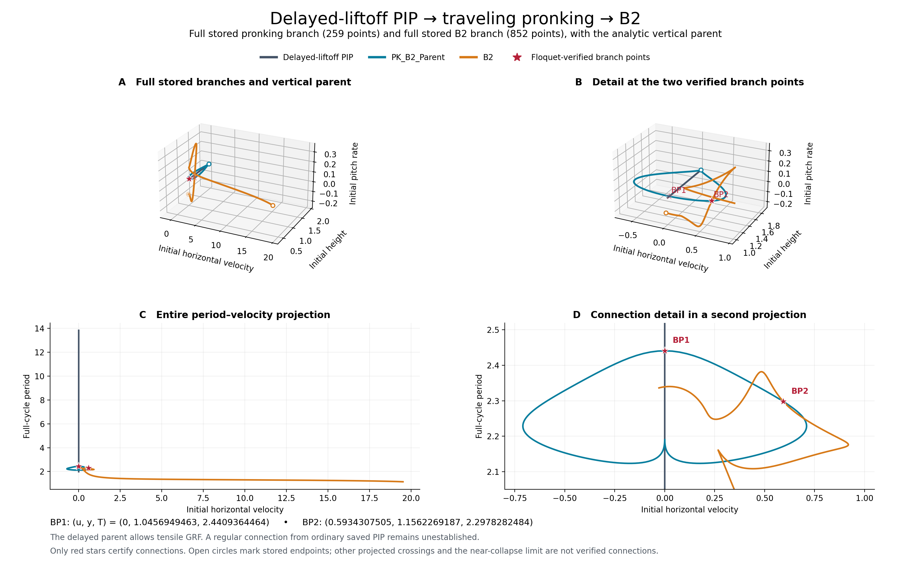
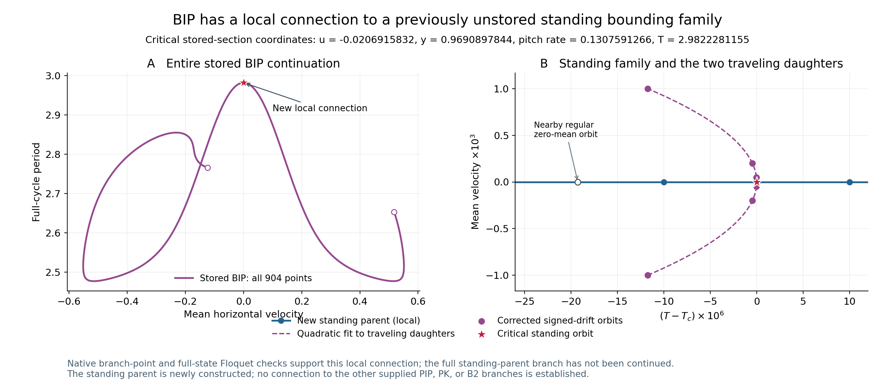
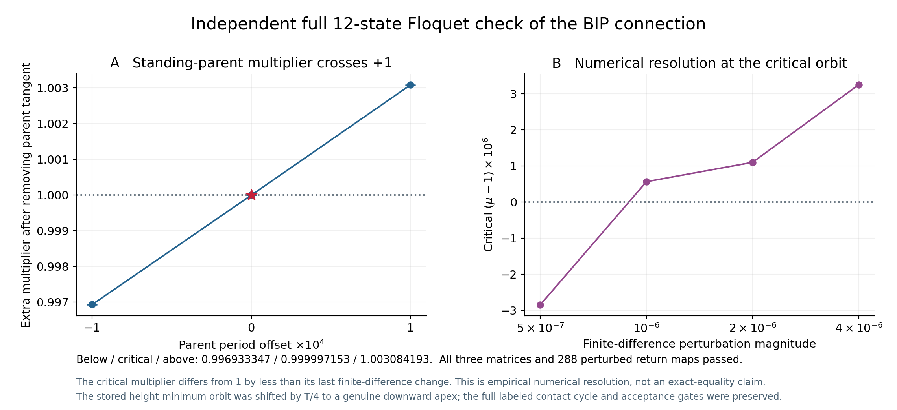
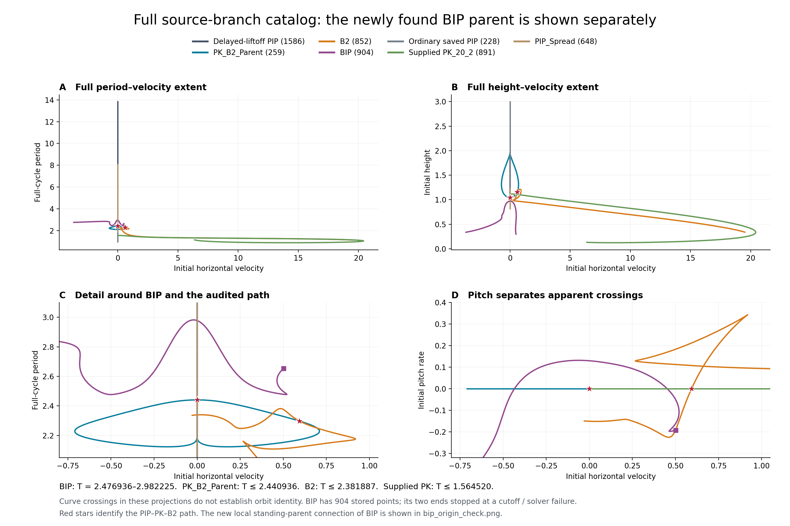

# Full branches and BIP connectivity

> Results-only layout. Numerical conclusions and evidence are retained. Historical filenames and run instructions refer to the [original numerical workspace](../../P2_Numerical_Run_Archive/P2_original_layout_20261007.tar.gz). Use the [result path map](Provenance/result_path_map.json) and [branch tree index](../README.md) for current locations.

The figures now show **all 259 stored PK_B2_Parent points and all 852 stored B2 points**, together with the full analytic delayed-liftoff vertical family. This expands the earlier figure, which displayed only the selected route between the branch points and the first two-flight B2 orbit.

The verified chain remains **delayed-liftoff PIP → PK_B2_Parent → B2**. A regular connection from the ordinary saved `PIP_10_20_2.mat` family to the delayed parent remains unestablished.

Open [explore_branches.html](../Figures/explore_branches.html) in a browser to rotate the full 3D branches, switch projections, inspect source columns, and compare BIP. The HTML embeds its data and has no remote dependencies. The PNG and PDF figures are static scientific exports. [full_branch_data.mat](Historical_Plot_Data/full_branch_data.mat) contains every plotted matrix in native 29-row format; matrices are kept separate so that concatenation does not invent connections.

## Reading the full diagram

Panels A and C show the entire computed extent; B and D enlarge the branch-point region. Red stars mark only the two connections with the accompanying full-state Floquet certificates. Open circles in the 3D panels mark stored continuation endpoints. Connecting consecutive points depicts the computed continuation; intersections of projected curves alone do not establish shared periodic orbits. In particular, the PK tails approach a leg-collapse boundary and must not be read as additional regular connections to the vertical line.

| Connection | Initial velocity | Initial height | Full-cycle period | Extra Floquet multiplier: below / critical / above |
|---|---:|---:|---:|---|
| Delayed PIP → PK_B2_Parent | 0 | 1.045694946314 | 2.440936446440 | 0.9970990097 / 1.0000000676 / 1.0029817283 |
| PK_B2_Parent → B2 | 0.593430750523 | 1.156226918733 | 2.297828248431 | 0.9940944651 / 1.0000000048 / 1.0058994502 |

These certificates are retained in [the parent audit](PIP_to_B2_Conclusion.md), including finite-difference convergence, the neutral parent direction, and independently corrected daughter directions. They establish these local connections, not stability of every plotted orbit. They were not recomputed merely to change the plotting range.

The new analytic vertical data contain **1,586 delayed-PIP samples** spanning the open regular energy interval `1 < E < 20`, with finite plotted bounds `1.0000000001 ≤ E ≤ 19.99999`. Energy equals flight-apex height; the stored delayed-PIP initial height is its tensile stance apex. The MAT file also contains 1,586 equal-energy ordinary-PIP samples. The catalog figure uses the 228-point ordinary source snapshot so its supplied extent remains explicit.

Exact segment composition and 144 independent Cartesian full-cycle replays support the vertical construction, with maximum Cartesian return error **3.98e-12**. Sampled native angular replays pass 18/18 ordinary and 16/18 delayed points. Two delayed samples very near leg collapse lose the invariant vertical trajectory in the angular integrator, with residuals `7.04e-7` and `0.0126`; they are retained as **analytic data**, with the numerical failure disclosed in [NATIVE_REPLAY.md](../Stages/00_Vertical_PIP_Families/Audit/NATIVE_REPLAY.md). No full-native-validation claim is made for this analytic tail.

## Is BIP connected to another branch?

**BIP does have a local bifurcation from a newly constructed standing bounding family. That parent was absent from the supplied P2 files.** It remains distinct from the other supplied PIP, PK, and B2 branches.

The critical standing orbit, in the source file's height-minimum section, has:

- Initial horizontal velocity **−0.020691583208**; mean velocity approximately zero.
- Initial height **0.969089784386** and pitch rate **0.130759126579**.
- Full-cycle period **2.982228115452**.
- Native residual infinity norm **3.60e-13**.

Six traveling daughter orbits with mean velocities `±0.001`, `±0.0002`, and `±0.00005` converge to this orbit. Two independent even-in-speed extrapolations differ by only `6.43e-11` in the 22 state/event coordinates. Its continuation Jacobian has two resolved near-null singular values (`1.17e-11`, `1.59e-9`), separated from the next (`0.0385384`); finite-difference refinement changes the full matrix by about `5.82e-8`. Standing neighbors at period offsets ±0.0001 have one null direction, and the additional signed mode crosses through zero. Parent and daughter tangents are independent and lie in the critical two-dimensional kernel.

The daughter-to-source connection was checked explicitly: corrections starting from the signed-drift daughters recover saved columns **233 and 234** to maximum coordinate differences **2.97e-10** and **4.17e-11**. This ties the local bifurcation to the actual 904-point file. The local geometry fits `T−Tc ≈ −11.7454 (mean velocity)^2`; this is a numerical local fit, not a global normal-form claim.

[BIP_Standing_Parent_Local.mat](../Stages/90_Separate_Standing_Bounding_to_BIP/Bifurcation_Analysis/BIP_Standing_Parent_Local.mat) stores the critical 29-vector, four local standing-parent points, six traveling daughters, and the three full Floquet matrices with their apex-phase orbits. It is explicitly a **local** parent segment.

An independent **12-state Floquet check passed all three matrices and 288 perturbed return maps**. After removing the neutral standing-parent tangent, the extra multiplier is **0.996933347 → 0.999997153 → 1.003084193** at parent periods `Tc−0.0001`, `Tc`, and `Tc+0.0001`. The stored height-minimum orbit was shifted by `T/4` to a genuine downward apex; the complete labeled cycle, contact history, and acceptance gates were preserved.

All four finite-difference levels keep the below/above multipliers on opposite sides of +1. At the critical orbit, the distance to +1 (`2.85e-6`) is smaller than the last multiplier change (`3.41e-6`), so +1 is supported within the observed numerical resolution. The absolute full-matrix refinement change is about `2.09e-4` (relative `1.60e-6`); the full matrix is more sensitive than the tracked eigenvalue. This is empirical numerical verification alongside the independent native double-kernel/daughter evidence, not a rigorous norm-bound proof or an exact floating-point equality claim. Full matrices, phase corrections, spectra, and diagnostics are in the [BIP Floquet report](../Stages/90_Separate_Standing_Bounding_to_BIP/Audit/FLOQUET_REPORT.md). Independently phase-shifted daughter pairs converge into the parent-removed critical eigenspace, with distances 0.002576, 0.0001036, and 0.000006274 as the mean-speed amplitude decreases from 0.001 to 0.00005.

The current BIP file contains 904 points, and all 904 pass fresh native periodic-orbit replay, with maximum residual norm **9.88e-10**. Its separation from the other supplied files is supported by the following checks.

| Stored family | Minimum period | Maximum period | Separation from BIP |
|---|---:|---:|---|
| BIP | 2.476936236 | 2.982224684 | — |
| PK_B2_Parent | 2.123276736 | 2.440936446 | Period gap ≥ 0.035999789 |
| B2 | 1.144569904 | 2.381886791 | Period gap ≥ 0.095049444 |
| Supplied PK_20_2 | 0.896710786 | 1.564520214 | Period gap ≥ 0.912416021 |

These period gaps exclude the same stored full-cycle orbit, independent of starting phase. Ordinary PIP, delayed PIP, and PIP_Spread are excluded by contact synchronization: every stored BIP orbit has front/hind touchdown and liftoff separation **0.411612–0.499999 cycles**, whereas those families have synchronized events. Every BIP record has zero all-leg flight intervals and one nondegenerate stance and swing interval per labeled leg. Phase shifts, reflection, or simple repeated covers cannot remove that difference.

The two pitch-rate sign changes were locally corrected and checked:

| Source bracket | Corrected initial velocity | Initial height | Hind angle | Front angle |
|---|---:|---:|---:|---:|
| 134–135 | 0.451853599780 | 0.834876982097 | 0.333428201 | −0.333428201 |
| 345–346 | −0.434169576058 | 0.852944189436 | −0.289895923 | 0.289895923 |

Both have native residual about `3e-13` and only the ordinary one-dimensional continuation null direction. The next Jacobian singular values are approximately `0.0488` and `0.1079`, well above the numerical uncertainty. They do not restore pronking symmetry and are not detected branch points.

The original `u≈0` seed is source column **228**. Its **mean velocity is +0.0193809247**, so the seed is not stationary. Its smallest Jacobian singular values are approximately `2.00e-10`, `0.00941613`, and `0.0383992`, again supporting a regular continuation point. The stored `dy=0` section is a vertical minimum there (`ddy≈+0.191916`); zero initial horizontal velocity must not be identified with zero stride displacement or with a vertical PIP orbit. These are native continuation-Jacobian checks. A direct zero-mean correction first found a nearby regular standing orbit at period 2.982208850266; it is distinct from the actual critical orbit at 2.982228115452. Nonzero signed-drift constraints were needed to approach the bifurcation without switching to that regular standing segment.

The first endpoint stops at the configured initial-height cutoff (`y≈0.298008`, cutoff 0.3). The other stops numerically (`u≈−3.663305`, `y≈0.337309`); its finite-difference Jacobian is unreliable. Neither stop is a demonstrated mathematical branch endpoint. These endpoints leave further global continuation questions open; they do not affect the newly found local standing-parent bifurcation inside the branch. The newly found standing parent resolves the missing **local** connection. Connections of that parent to other families, and continuation beyond the saved BIP endpoints, remain unestablished.

Detailed evidence: [phase and contact comparison](../Stages/99_Comparison_Families/Audit/COMPARISON_REPORT.md), [fresh dynamics and local rank checks](../Stages/90_Separate_Standing_Bounding_to_BIP/Audit/BIP_ORIGIN_REPORT.md), and their MAT/JSON/CSV files. Original P2 branch files were preserved byte-for-byte.

