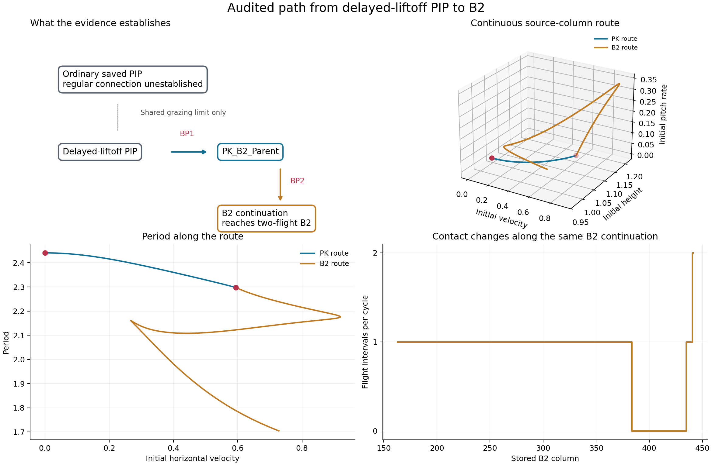
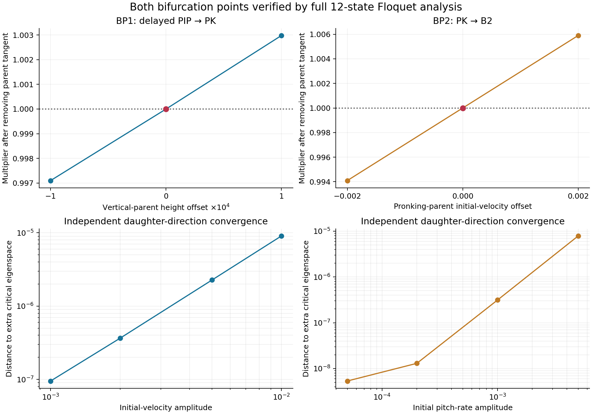
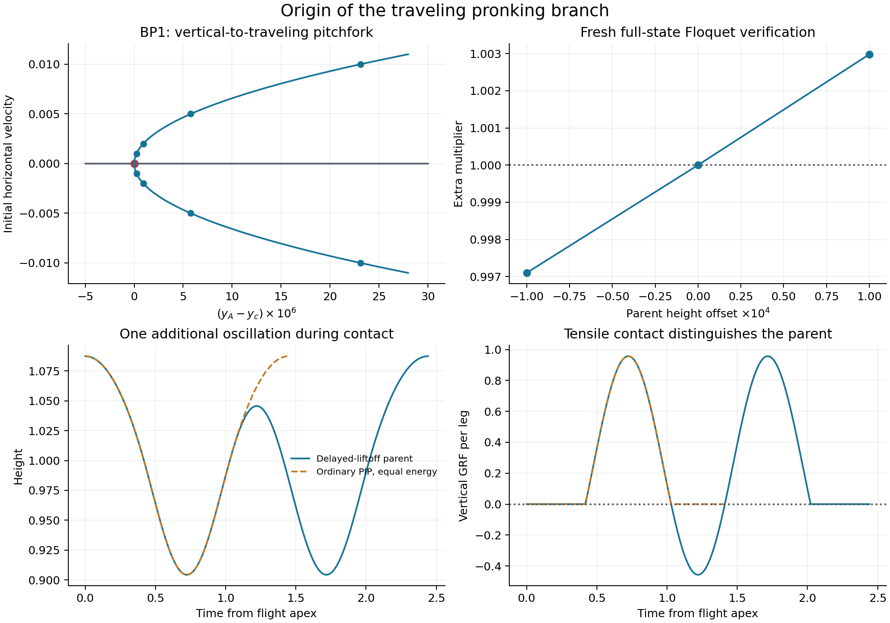

# PIP to B2: independent path audit

> Results-only layout. Numerical conclusions and evidence are retained. Historical filenames and run instructions refer to the [original numerical workspace](../../P2_Numerical_Run_Archive/P2_original_layout_20261007.tar.gz). Use the [result path map](Provenance/result_path_map.json) and [branch tree index](../README.md) for current locations.

**A numerical path is verified from the delayed-liftoff PIP family to B2. A regular path starting from the ordinary saved `PIP_10_20_2.mat` family is not yet established.** The qualified chain is:

**Delayed-liftoff vertical PIP → traveling `PK_B2_Parent` → B2 continuation → two-flight B2.**

This folder is independent of the surrounding experiment folders: it contains input MAT snapshots, the frozen dynamics/Floquet runtime, fresh numerical outputs, figures, reproduction scripts and SHA-256 manifests. Existing branches and numerical source files were not changed.

The full stored branches and a new BIP connectivity audit are available in [full_branches/](FULL_BRANCHES_AND_BIP.md), including [the entire-path figure](../Figures/entire_path.png) and an interactive branch viewer. The new audit also identifies and Floquet-checks a local standing-bounding parent of the branch stored as BIP; this is separate from the PIP–PK–B2 path.

## The two verified bifurcation points

| Point | Parent → daughter | Initial horizontal velocity | Initial height | Period |
|---|---|---:|---:|---:|
| BP1 | Delayed-liftoff PIP → traveling pronking | 0.0000000000 | 1.045694946314 | 2.440936446440 |
| BP2 | Traveling pronking → B2 | 0.593430750523 | 1.156226918733 | 2.297828248431 |

BP1 is source column **132** of `data/PK_B2_Parent.mat`; BP2 is source column **110**. BP2 is bracketed by original B2 columns **162–163**. BP1's initial height is the tensile-stance apex; its flight-apex height is **1.087455508686**.

Fresh **12×12 reduced-state Floquet matrices** were computed at each point and on both sides. All **6 preferred matrices** and their **576 perturbed return maps** passed the unchanged timing, periodicity, topology, finite-difference convergence and forward/backward checks. Event times were re-solved by the frozen production dynamics; they were not Floquet coordinates. A neutral parent-family direction was removed before identifying the extra +1 mode.

| Connection | Below | Critical | Above | Parent-coordinate offsets |
|---|---:|---:|---:|---|
| BP1 | 0.9970990097 | 1.0000000676 | 1.0029817283 | initial height ±0.0001 |
| BP2 | 0.9940944651 | 1.0000000048 | 1.0058994502 | initial velocity ±0.002 |

The maximum changes between the two finest full matrices are **1.78e-07** for BP1 and **7.5e-08** for BP2. These empirical numerical errors set the meaningful precision; the displayed critical multipliers are not claims of exact floating-point equality to one. At each critical point, `M-I` has the parent tangent plus one additional near-null direction, separated from the remaining singular values. Independently corrected daughter pairs converge to that additional subspace after removing the parent tangent.

For BP1, the nonlinear equation independently gives `y_A-y_c = 0.2311546965 u^2 + O(u^4)`, confirming the reflected traveling pitchfork. For BP2, the additional direction includes pitch and front/hind differences while preserving left/right pairing. We establish the branch connection without assigning a nonlinear bifurcation subtype from a +1 crossing alone.

Full spectra, numerical matrices, perturbation levels, acceptance diagnostics and daughter subspace checks are in [BP1 Floquet audit](../README.md) and [BP2 Floquet audit](../README.md). `reports/bifurcations.csv` and `audit_summary.mat` collect the key data. The full spectra include modes other than the crossing mode; this is a connectivity certificate, not a claim that the path is dynamically stable.

## Why ordinary PIP requires a qualification

The delayed-liftoff parent stays in contact through an extra vertical oscillation and negative GRF. At BP1's energy, ordinary PIP has period **1.447477619861**, while the delayed parent has period **2.440936446440**. The difference is exactly `2*pi/sqrt(40) = 0.993458826580`. Flight duration agrees, but liftoff and contact history differ. Matching continuous apex state or shifting phase therefore does not establish orbit identity.

As flight duration tends to zero, both families approach the same all-stance harmonic trajectory; the delayed family traverses it twice. This is a **grazing, zero-flight, double-cover limit**. Contact-event velocity vanishes and the event chart degenerates there. It is not a verified regular ordinary-PIP-to-delayed-PIP bifurcation. Thus the audit does **not** draw a solid connection from ordinary saved PIP to the delayed parent. The two-flight B2 route is also not a path restricted to nonnegative GRF.

The exact formulas, boundary comparisons and chart qualifications are recorded in [topology/](../README.md).

## Continuation route and orbit validation

`data/route_segments.mat` stores the route in continuation order, with source indices. The traveling segment is PK columns **132 → 110**, comprising **23 samples**. The selected B2 side uses independently corrected small positive-pitch daughter states, joins source column **163**, and follows the stored continuation to the first two-flight sample at column **441**. The full 852-point B2 file is also included.

Every one of **898 orbit records** was freshly reintegrated without re-solving stored event times: seven local delayed-PIP points, eight local traveling daughters, 23 PK path points, eight local B2 daughters, and all 852 B2 points. **All pass residual 1e-8**; maximum residual is **3.54534e-09**. Signed velocities and tensile forces were permitted. The circular event-chart step metric avoids misinterpreting wrapped event times as discontinuities; the largest adjacent 13-state change on the selected B2 route is **0.05**.

The number of flight intervals changes along the same continued B2 family:

| B2 source-column bracket | Flight intervals | Interpretation |
|---|---|---|
| 383–384 | 1 → 0 | Flight interval closes |
| 434–435 | 0 → 1 | Flight interval opens |
| 440–441 | 1 → 2 | Second flight interval appears |

These brackets are contact-itinerary changes, recorded separately from BP1/BP2; they are not represented as smooth +1 Floquet bifurcations. Their exact nonsmooth boundary orbits were not localized in this audit. Column 441 has initial velocity **0.7275373218**, mean velocity **0.7150856957**, and two distinct flight intervals. The route establishes connection to the supplied B2 continuation using finite samples, local corrections and Floquet directions; it is not a rigorous global existence theorem or a new claim that every endpoint of B2 has been found.

