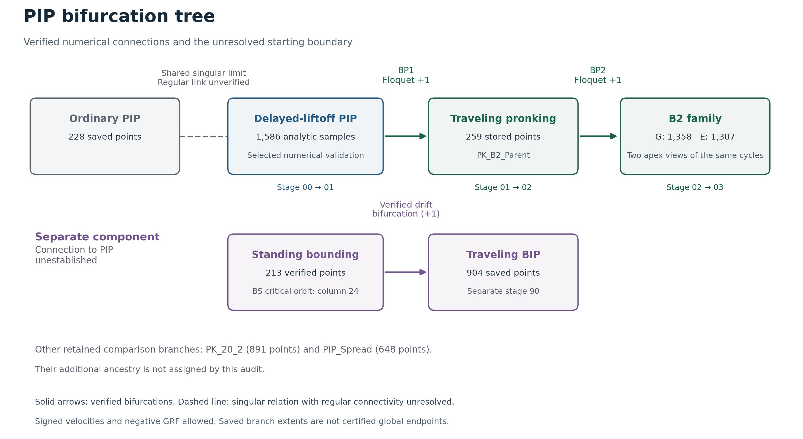

# PIP bifurcation tree and reached quadrupedal families

The certified numerical route is **delayed-liftoff PIP → traveling pronking → B2**. The two junctions have full-state Floquet +1 crossings and independent daughter-direction checks. **A regular connection from the ordinary saved PIP family to delayed PIP remains unestablished.** Their common zero-flight limit is singular and involves a double cover; it is shown as an unresolved relation, not a verified bifurcation.

## Stages of the tree

| Stage | Family or connection | Status and evidence |
|---|---|---|
| [00 Vertical PIP families](Stages/00_Vertical_PIP_Families/README.md) | Ordinary PIP and delayed-liftoff PIP | Distinct contact histories; shared singular limit, regular connection unverified |
| [01 Delayed PIP to pronking](Stages/01_Delayed_PIP_to_Pronking/README.md) | Delayed PIP → PK_B2_Parent | Verified bifurcation BP1, full Floquet and nonlinear daughter evidence |
| [02 Pronking to B2](Stages/02_Pronking_to_B2/README.md) | PK_B2_Parent → B2 | Verified bifurcation BP2, full Floquet and daughter evidence |
| [03 B2 continuation and apex views](Stages/03_B2_Family_and_Apex_Views/README.md) | Extended B2 and its G/E representations | Same periodic family viewed at different apices; no additional bifurcation is inferred from rephasing |
| [90 Separate standing family](Stages/90_Separate_Standing_Bounding_to_BIP/README.md) | Standing bounding → traveling BIP | Verified local drift bifurcation; connection to PIP remains unestablished |
| [99 Comparison families](Stages/99_Comparison_Families/README.md) | Supplied PK_20_2 and PIP_Spread | Retained comparison data; no additional ancestry assigned by this audit |

## Branch datasets

The existing branch MAT files retain their original filenames and locations. The additional delayed-PIP file is the original analytic-family dataset, renamed for clarity without changing its contents.

| File | Points | Interpretation |
|---|---:|---|
| [PIP_10_20_2.mat](PIP_10_20_2.mat) | 228 | Ordinary supplied PIP |
| [PIP_Delayed_Analytic_10_20_2.mat](PIP_Delayed_Analytic_10_20_2.mat) | 1586 | Delayed PIP analytic samples with selected numerical validation; also contains an equal-energy ordinary comparison array |
| [PK_B2_Parent.mat](PK_B2_Parent.mat) | 259 | Pronking parent of B2; all 259 replayed; 223 pass native compatibility, and all 259 pass independent Cartesian acceptance |
| [B2_10_20_2_G.mat](B2_10_20_2_G.mat) | 1358 | Extended B2, all 852 original points preserved |
| [B2_10_20_2_E.mat](B2_10_20_2_E.mat) | 1307 | Accepted other-apex views of the same B2 cycles; source mappings preserve excluded gaps |
| [BS_10_20_2_BIP_Child.mat](BS_10_20_2_BIP_Child.mat) | 213 | Standing bounding parent; the original requested filename is retained |
| [BIP_10_20_2.mat](BIP_10_20_2.mat) | 904 | Traveling family emerging from standing bounding |
| [PK_20_2.mat](PK_20_2.mat) | 891 | Supplied comparison pronking family |
| [PIP_10_20_2_Spread.mat](PIP_10_20_2_Spread.mat) | 648 | Supplied comparison family |

Only 18 delayed-PIP samples were replayed with the native angular evaluator: 16 passed and two failed near leg collapse. The remaining analytic samples are not certified by native replay. See the stage 00 validation report. Signed velocities and negative GRF were allowed in these searches, and no complete global branch extent is claimed.

## Figures and conclusion audits

- [Current route with extended B2](Figures/extended_path.png), [B2 continuation](Figures/b2_extended_branch.png), and [the two apex views](Figures/apex_equivalence.png).
- [Floquet verification of the PIP–pronking–B2 junctions](Figures/floquet_verification.png) and [ordinary versus delayed PIP](Figures/origin_check.png).
- [Standing branch](Figures/BS_branch_summary.png), [BIP origin](Figures/bip_origin_check.png), and [BIP Floquet verification](Figures/bip_floquet_verification.png).
- [Historical full-branch figure](Figures/entire_path.png) and [interactive viewer](Figures/explore_branches.html), retaining the earlier 852-point B2 snapshot.
- [Combined path conclusion](Audit/PIP_to_B2_Conclusion.md), [full branches and BIP audit](Audit/FULL_BRANCHES_AND_BIP.md), and [phase-representation audit](Audit/Phase_Representation/REPORT.md).

`Stages` contains the numerical bifurcation analyses and their conclusion audits. `Audit/Route` retains the exact critical orbits, route mappings and validation records. Saved rejected candidates remain audit evidence and are not additional accepted branch points. [branch_tree.json](branch_tree.json) records the nodes, edge types and evidence paths.

## Archived numerical machinery

This is a results-only folder. Run-specific evaluators such as `BS_TightCycle_v2.m`, continuation drivers, frozen runtime copies, prototypes and intermediate checkpoints are in the [complete original-layout archive](../P2_Numerical_Run_Archive/README.md). Removing their loose files does not change the saved branches or analyses; rerunning the checks requires the archived workspace.

`BS_TightCycle_v2.m` replayed the same full-cycle equations at tighter ODE tolerances, without correcting orbit coordinates. Its checks excluded 20 of 233 native-passing standing candidates, leaving the delivered 213. The replay results remain in stage 90.

Historical embedded paths in MAT files and old provenance manifests identify the original run. The [result path map](Audit/Provenance/result_path_map.json) resolves them to current results or the archive. [bundle_manifest.json](bundle_manifest.json) records the verified file identities and organization checks.
