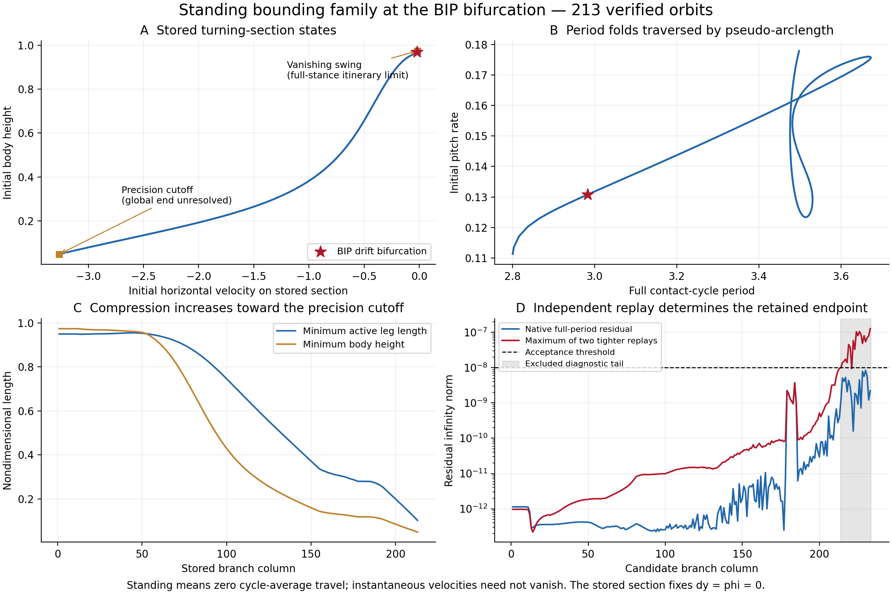

# Standing bounding family connected to BIP

> Results-only layout. Numerical conclusions and evidence are retained. Historical filenames and run instructions refer to the [original numerical workspace](../../../../P2_Numerical_Run_Archive/P2_original_layout_20261007.tar.gz). Use the [result path map](../../../Audit/Provenance/result_path_map.json) and [branch tree index](../../../README.md) for current locations.

Saved **`BS_10_20_2_BIP_Child.mat` with 213 verified orbits (29×213)**. The BIP drift bifurcation is **column 24**. Both directions were continued using numerical one-dimensional pseudo-arclength continuation, including several period folds. Signed instantaneous velocities and negative GRF were allowed.

The complete mathematical extent is **not established**. One side approaches a zero-swing/full-stance itinerary boundary. The other side is retained only through the last contiguous point that passes the native model and two independent, tighter-tolerance replays. No collision or global isolation is claimed at that numerical cutoff.

## Meaning of standing and of the stored section

The cycle-average horizontal velocity is zero to numerical tolerance: maximum absolute mean speed `6.17e-10`. Horizontal velocity, pitch rate and leg angular rates vary during the cycle.

The inherited section fixes `dy0 = phi0 = 0`. At the critical orbit it is a **height minimum**, with initial velocity `-0.0206915832077`, height `0.969089784386`, pitch rate `0.130759126579`, and period `2.98222811545`. This is not the downward-apex phase used in the Floquet calculation. Section orientation can change along the family; it is not imposed as an acceptance condition.

For the **same critical orbit**, the previously verified downward-apex representation is one quarter-cycle later: initial horizontal velocity `0`, height `0.979906397311`, pitch angle `0.0598990900268`, pitch rate `0`, and the same full period. That example is embedded in `sourceInfo.criticalDownwardApexExample`; it is not a new family or an extra continuation segment.

## Verification and endpoints

Every retained orbit passes all of these at `1e-8`:

- Unchanged production full-period periodicity/contact residual: maximum `3.75e-09`.
- Exact half-cycle standing reflection residual: maximum `4.72e-09`.
- Full-period replay with both relative/absolute ODE tolerances `1e-13` and `3e-14`: maximum `9.63e-09`.
- Zero mean horizontal velocity and completion of the full contact cycle.

| Endpoint | Initial velocity | Initial height | Period | Minimum active leg length | Minimum swing duration |
|---|---:|---:|---:|---:|---:|
| Zero-swing approach | -0.0155699313 | 0.974193277 | 2.80015239 | 0.949930852 | 5.6e-09 |
| Retained precision cutoff | -3.26341058 | 0.0486797723 | 3.49747283 | 0.101897571 | 1.47044322 |

Five fixed-phase refinements approach swing duration zero while active leg length remains about `0.95`. The exact coincident touchdown/liftoff state is excluded: the native strict timing predicate would select no contact, whereas the limiting orbit has continuous stance. Continuing an all-stance itinerary would require a separate event representation.

The original full-period corrector stalled near initial velocity `-2.655`. A separately named half-cycle evaluator, with identical dynamics and resets and only its integration terminal changed, then advanced to about `-3.358`. All 233 candidates passed the native gate. Independent tighter replays revealed full-cycle error amplification in the final 20 candidates, so those remain in `native_passing_complete.mat` and raw checkpoints and are excluded from the user-facing MAT. At the last raw candidate, the native residual was `2.23e-9`, while tighter full-cycle residuals reached `1.27e-7`; corresponding half-cycle errors were only around `1e-10`. This supports a precision/conditioning boundary, not a demonstrated physical endpoint.

Across the retained data, the period spans `2.80015225` to `3.67266738` and the minimum **axial GRF** is `-8.32114303`. This is the per-leg axial spring force (native GRFs columns 1–4), not the vertical-force component. Negative values represent axial tension. There was no imposed velocity, height, or positive-GRF cap.

## Bifurcation provenance

The critical source and its hash are recorded in `sourceInfo`. The earlier native full22 Jacobian check showed a double kernel at the critical orbit, regular standing neighbors, and an independent drifting-daughter tangent. Correcting daughter orbits back to original BIP columns 233/234 reproduced all state and event coordinates within `2.97e-10`.

The separate full12-state Floquet calculation, with the true parent tangent removed, found the extra multiplier `0.99693335 → 0.99999715 → 1.00308419` across the standing-parent critical period. The middle value is consistent with +1 within its measured finite-difference refinement uncertainty. Paths to that report and the full-cycle data are stored in `sourceInfo.floquetVerification`.

