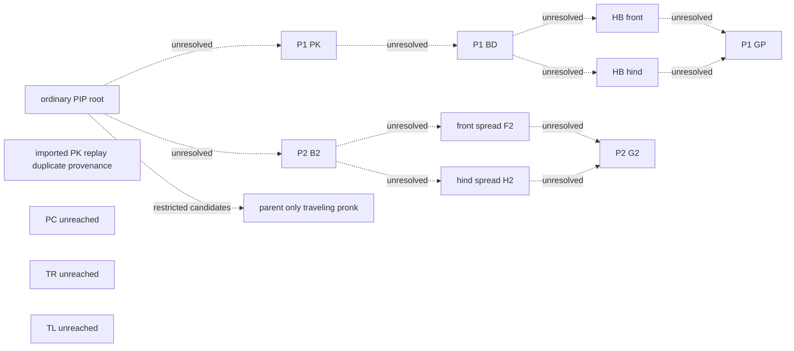

# Typed ancestry graph

Generated from saved JSON by `Research_v3/generate_research_index.py`. This graph records hypotheses and evidence; it does not run experiments or grant numerical certification.

The current restricted PIP→PK stage status is `budget_exhausted`. Each candidate displays its current source status. Earlier exploratory reports are not promoted to final certificates.

The ordinary PIP root is supported by independent vertical benchmarks. Imported autonomous replay nodes are separate from parent-only nodes. Identical P1/P2 PK source bytes are annotated as duplicate provenance. The P1 PK family and PK_B2_Parent remain separate until an attachment or full-orbit equivalence is demonstrated.

Solid certified ancestry edges are currently absent. Dotted edges are unresolved, and names do not impose contact history or verified flight count. BE/BG/FE/FG/HE/HG/GE/GG, historical delayed bridges and B2 G/E phase equivalence are retained in the machine graph as separate unresolved records.

Regular connectivity accepts validated regular symmetry-breaking or other validated local bifurcation edges. A separately assessed nonsmooth connectivity statement may additionally use admissible itinerary connections. Grazing limits, phase equivalences, multiple covers and numerical proximity alone do not establish ancestry. No graph edge presently counts toward either connectivity claim.

| Edge | Actual evidence type | Intended type | Current source status | Scope |
|---|---|---|---|---|
| `PIP-to-P1-PK` | `numerical_candidate_proximity_only` | `validated_regular_symmetry_breaking_connection` | `unresolved` | `required_network` |
| `P1-PK-to-BD` | `numerical_candidate_proximity_only` | `validated_regular_symmetry_breaking_connection` | `unresolved` | `required_network` |
| `P1-BD-to-HB-front` | `numerical_candidate_proximity_only` | `validated_regular_symmetry_breaking_connection` | `unresolved` | `required_network` |
| `P1-BD-to-HB-hind` | `numerical_candidate_proximity_only` | `validated_regular_symmetry_breaking_connection` | `unresolved` | `required_network` |
| `P1-HB-front-to-GP` | `numerical_candidate_proximity_only` | `validated_regular_symmetry_breaking_connection` | `unresolved` | `required_network` |
| `P1-HB-hind-to-GP` | `numerical_candidate_proximity_only` | `validated_regular_symmetry_breaking_connection` | `unresolved` | `required_network` |
| `PIP-to-B2` | `numerical_candidate_proximity_only` | `validated_regular_symmetry_breaking_connection` | `unresolved` | `required_network` |
| `B2-to-F2` | `numerical_candidate_proximity_only` | `validated_regular_symmetry_breaking_connection` | `unresolved` | `required_network` |
| `B2-to-H2` | `numerical_candidate_proximity_only` | `validated_regular_symmetry_breaking_connection` | `unresolved` | `required_network` |
| `F2-to-G2` | `numerical_candidate_proximity_only` | `validated_regular_symmetry_breaking_connection` | `unresolved` | `required_network` |
| `H2-to-G2` | `numerical_candidate_proximity_only` | `validated_regular_symmetry_breaking_connection` | `unresolved` | `required_network` |
| `P1-BD-to-BE` | `numerical_candidate_proximity_only` | `numerical_candidate_proximity_only` | `unresolved` | `subclass_hypothesis` |
| `P1-BD-to-BG` | `numerical_candidate_proximity_only` | `numerical_candidate_proximity_only` | `unresolved` | `subclass_hypothesis` |
| `P1-BD-to-FE` | `numerical_candidate_proximity_only` | `numerical_candidate_proximity_only` | `unresolved` | `subclass_hypothesis` |
| `P1-BD-to-FG` | `numerical_candidate_proximity_only` | `numerical_candidate_proximity_only` | `unresolved` | `subclass_hypothesis` |
| `P1-BD-to-HE` | `numerical_candidate_proximity_only` | `numerical_candidate_proximity_only` | `unresolved` | `subclass_hypothesis` |
| `P1-BD-to-HG` | `numerical_candidate_proximity_only` | `numerical_candidate_proximity_only` | `unresolved` | `subclass_hypothesis` |
| `P1-BD-to-GE` | `numerical_candidate_proximity_only` | `numerical_candidate_proximity_only` | `unresolved` | `subclass_hypothesis` |
| `P1-BD-to-GG` | `numerical_candidate_proximity_only` | `numerical_candidate_proximity_only` | `unresolved` | `subclass_hypothesis` |
| `ordinary-to-delayed-PIP` | `numerical_candidate_proximity_only` | `grazing_zero_duration_boundary_limit` | `specific_vertical_history_incompatible` | `boundary_bridge` |
| `delayed-PIP-to-PK-B2` | `numerical_candidate_proximity_only` | `validated_regular_symmetry_breaking_connection` | `unresolved` | `historical_route` |
| `PK-B2-to-B2` | `numerical_candidate_proximity_only` | `validated_regular_symmetry_breaking_connection` | `unresolved` | `historical_route` |
| `P1-PK-to-PK-B2` | `numerical_candidate_proximity_only` | `validated_regular_symmetry_breaking_connection` | `unresolved` | `required_bridge` |
| `B2-G-E-phase` | `numerical_candidate_proximity_only` | `phase_proven_symmetry_equivalence` | `unresolved` | `equivalence` |
| `ordinary-grazing-limit` | `numerical_candidate_proximity_only` | `grazing_zero_duration_boundary_limit` | `unresolved` | `boundary_bridge` |
| `delayed-cover-limit` | `numerical_candidate_proximity_only` | `multiple_cover_identification` | `unresolved` | `boundary_bridge` |
| `restricted-PIP-PK-1` | `numerical_candidate_proximity_only` | `validated_regular_symmetry_breaking_connection` | `numerically_supported_restricted_attachment` | `restricted_local_experiment` |
| `restricted-PIP-PK-2` | `numerical_candidate_proximity_only` | `validated_regular_symmetry_breaking_connection` | `numerically_supported_restricted_attachment` | `restricted_local_experiment` |

Each edge has a small evidence directory under `Research_v3/graph/edges/`; the JSON points to shared campaign artifacts instead of duplicating trajectories. `Research_v3/graph/index.json`, `solutions.json`, and `validation.json` contain the graph, indexed solution summaries, and actual schema/semantic validation results.

The complete independent replay evidence is `Research_v3/runs/full/solution_index.json` when present. Its dedicated schema is validated by the same refresh command. A parent-edge graph reference is not itself a parent-edge certificate.

Refresh after final numerical stages with `python3 SLIP_Quadruped_v3/Research_v3/generate_research_index.py --config full` and `python3 SLIP_Quadruped_v3/Research_v3/generate_family_reports.py`. The graph status remains unresolved until a separate final assessment supplies the required certificates.
