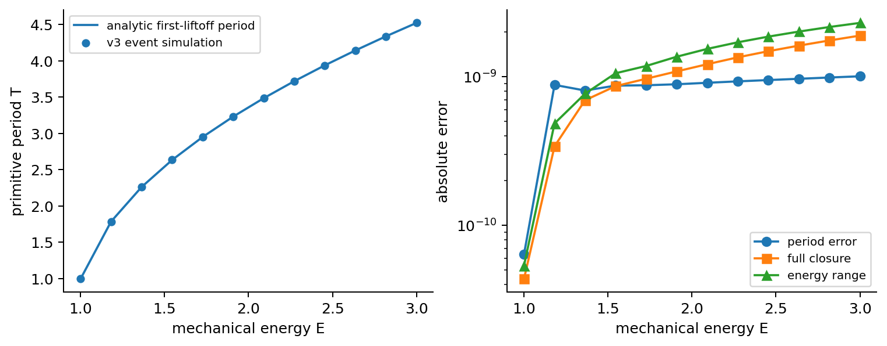
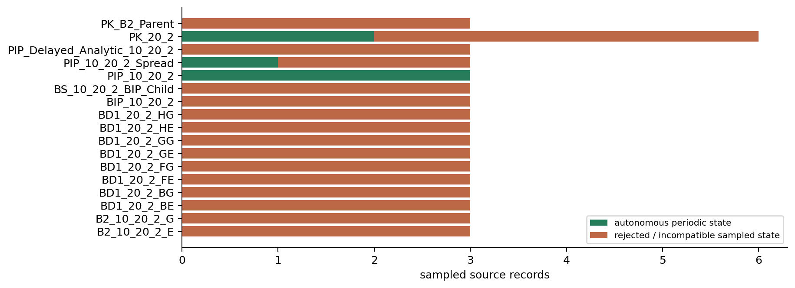
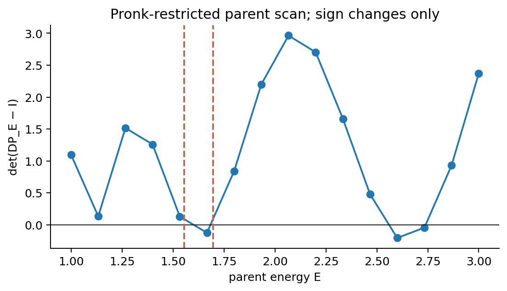
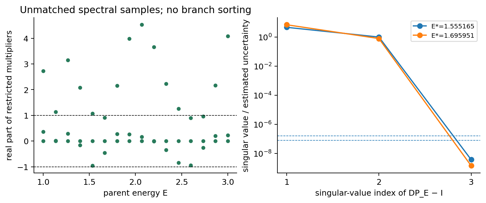
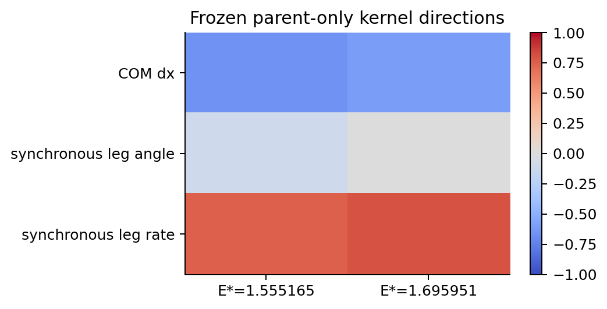
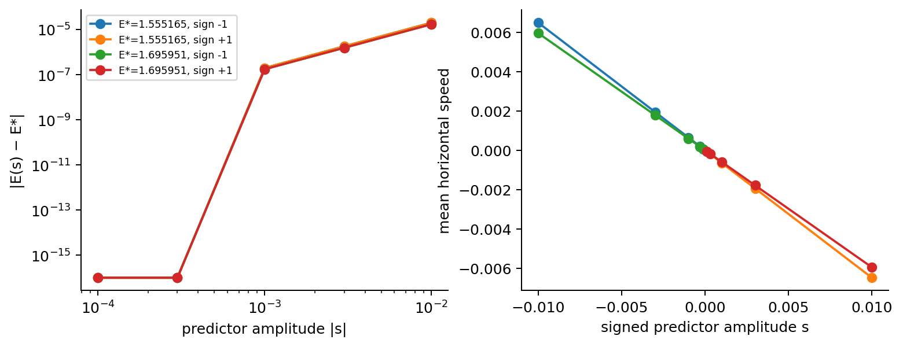
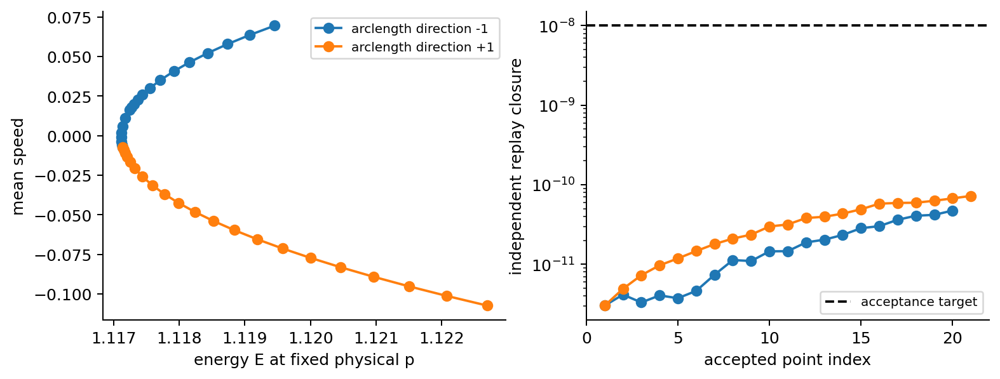
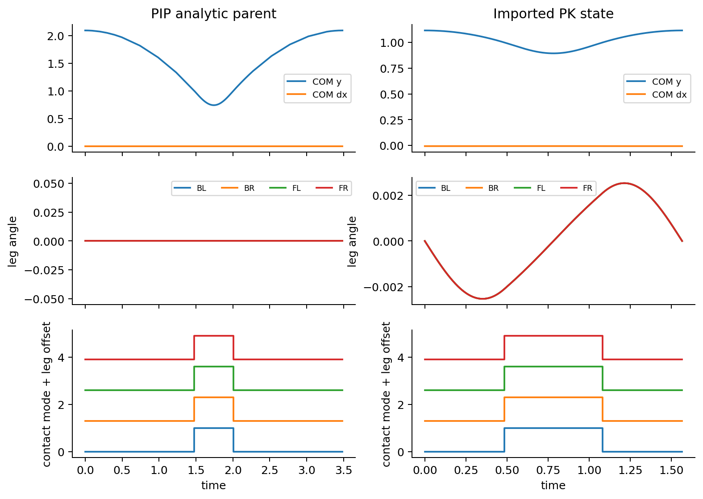

# Final research status — quadruped v3

This document preserves the campaign committed at `f53c39cca530d9782d00ba8699acb1d55484f7d8`. The subsequent MATLAB execution, expanded source domain, repaired solver, new branch results and qualified local PIP–imported-PK connection are documented in [Next_Round_Research_Findings_v3.md](Next_Round_Research_Findings_v3.md) and [Next_Round_Full_Execution_v3.md](Next_Round_Full_Execution_v3.md). Historical numbers and failure conclusions below retain their original scope. The full named P1/P2 network remains unestablished.

Generated from saved execution evidence on 2026-10-07T11:00:36.825875+00:00.

The requested single PIP-rooted gait network is **unresolved** in the registered autonomous model and bounded domain. Local mathematical propositions are derived conditionally. Ordinary vertical PIP and traveling pronk states are reproduced and continued; imported ancestry is not inferred. Restricted parent-only attachment status is determined by the checks below. Full simultaneous-contact smoothness, unrestricted stability, P1/P2 bridging, coverage, and global connectivity are not established.

## Hypotheses and model

The model is `v3-autonomous-first-directed-root-compressive-stance`. It uses the first eligible descending touchdown and ascending liftoff, with compressive stance, explicit reset ownership, and the unchanged 14-coordinate physical schema. Fixed baseline physical parameters are `[10,10,20,20,1,1,0,0,2,0.5]`. The registered energy interval is `[1.0001,3]`, mean speed lies in `[-3,3]`, pitch magnitude is at most `1.2`, primitive period at most `12`, and the event bound is `64`. Translation, time phase, and proven fixed-parameter symmetries are the allowed equivalences. The desired graph permits regular connections; nonsmooth candidates are recorded separately.

`H_local` is assessed for specified local connections; the executed support here is numerical and restricted. `H_network` (one root reaching both target studies), `H_coverage` (all registered classes), and `H_global` (every admissible primitive orbit) remain unresolved. PC/TR/TL are included in the declared universe; they have not been recovered. The historical P1 critical point has energy greater than `9.83045`, outside the registered interval. This campaign does not assess that critical point and does not claim its nonexistence.

## Methods and implementation

The new physical chart removes one dependent stored angular rate per stance leg. Apex/translation dimension is `12 − number_of_stance_legs`. Energy conservation supplies an independent fixed-parameter family residual: one closure equation is eliminated through a regular energy pivot and replaced by the energy equation; the full physical closure remains mandatory at acceptance. Pseudo-arclength continuation checks tangent rank, full closure, topology, conditioning, and restart replay. Corrected distance-constrained second seeds use these same services.

Gait classification uses complete state/contact histories, circular flight intervals, primitive-cover checks, descriptive front/hind pairing, and motion residuals. BL marking is an explicit local chart with a prescribed touchdown occurrence. Synthetic overlap/coincidence checks and an actual PIP replay were executed before cleanup; no physical B2 chart-overlap example was validated in this campaign. A label and equal contact times are not a proof of isotropy.

The finite-difference Floquet API uses physical tangent coordinates and nonlinear retraction. Energy/family neutrality is distinguished from extra critical modes. Split-contact perturbations are allowed to fail closed. A restricted matrix is not used as a full-system stability certificate. See [mathematical methods](Periodic_Orbit_and_Bifurcation_Theory_v3.md), [LaTeX source](Periodic_Orbit_and_Bifurcation_Theory_v3.tex), and [model audit](Model_Equivalence_Audit_v3.md). The standalone LaTeX source compiled successfully using the native editor; its PDF preview is available there, with no separate exported PDF claimed.

## Executed numerical results

The compatibility stage sampled 54 columns from 18 checksum-preserved fixtures: first, middle, and last columns of each family. 6 source records produced autonomous periodic states. P1 contributes one and P2 five. The two PK fixture copies are identical, so these are five distinct mapped states; the nearzero PIP state lies outside the registered energy interval, leaving four distinct admitted comparison states. Period/contact identity is checked independently of autonomous state acceptance. B2 and its other-apex view are not counted as independent discoveries. Per-family rejection conditions, parameters, source columns, and first divergences are in [P1 reproduction](P1_Reproduction_Report_v3.md) and [P2 discovery](P2_Discovery_Report_v3.md).

The corrected nearzero touchdown occurs at `0.00014142135426574`, approximately `1.54e-12` from its analytic time. Two diagnosed detector defects were repaired: storing samples after an earlier chosen event, and premature simultaneity clustering based on guard value alone. Simultaneity now also requires a local event-time test. The latter regression was observed failing before the change and passing afterward. Unsupported grazing remains a boundary qualification.

The analytic vertical benchmark executed 12 energies. Maximum period error is 1.00561e-09, full closure 1.88879e-09, and energy variation 2.30014e-09. Delayed scheduled histories have extra stance revolutions; they suppress the first liftoff and traverse tensile stance. They are incompatible with this contact law. A common geometric limit does not provide a regular root bridge.

The imported PK energy-family stage status is `completed`. Both predictor directions preserve physical p, and every stored accepted point is classified. The stopping reason below is numerical, not a proof of a complete family. The fresh positive-direction run retained 21 points instead of the registered 20 because of a resume-overlap counting bug. This deviation is disclosed in fixed_family.json and fixed prospectively; no observation was deleted. Resumed convenience arrays were also rebuilt from the authoritative complete point records without changing those orbits.

| Arclength direction | Accepted points | Stop | Maximum full closure |
|---|---:|---|---:|
| -1 | 20 | maximum point count reached | 3.38853e-10 |
| +1 | 21 | maximum point count reached | 2.96107e-10 |

The unrestricted alternative stage tried 6 frozen symmetry-sector predictors; none certified a daughter edge. These trials are not an exhaustive search. Ordinary full-state PK Floquet differentiation returned dimension 12 and reliable=`False` because nearby trials changed section-relative event charts. No full-system spectrum or stability conclusion is drawn from its NaN entries.

## Parent-only critical points and signed corrections

The current stage is `budget_exhausted`. It scans 16 deterministic parent energies, finds sign changes of `det(DP_E−I)` in a fixed-energy three-coordinate pronk chart, and refines at most two brackets. Predictions are saved before daughter correction and use no imported daughter states. Even-multiplicity crossings, tangent zeros, and intervals containing multiple zeros can be missed. An additional exact restricted-parent resonance check predicts a +1/−1 spectral point at E=1.06168502751 inside the first coarse interval, which this sign-change grid missed. Its daughter attachment was not computed. The first observed critical energy agrees with the n=1 resonance prediction within approximately 4.1e-9. These analytic checks are described in the parent-only validation document; [three unprocessed candidates](../Research_v3/parent_candidate_queue_v3.json) are retained separately. Derivative and solve tolerances were tightened as a recorded validation amendment, without changing the search domain; the prior exploratory files are versioned.

| Critical energy | Evidence status | Converged signed samples | Left-kernel mixed derivative | Failed gates |
|---:|---|---:|---:|---|
| 1.55516525164 | numerically_supported_restricted_attachment | 10/10 | 1.13161 ± 0.000427461 | none |
| 1.69595083617 | numerically_supported_restricted_attachment | 10/10 | 0.953444 ± 0.000863132 | none |

The first critical point also has a restricted multiplier near −1 within estimated matrix uncertainty. The fixed-point +1 kernel remains simple, but an isolated one-center dynamical normal form or stability claim is unsupported. The evidence gate requires a resolved simple kernel and cokernel, mixed-derivative signal above estimated uncertainty, signed amplitude sequences, genuine corrections, stricter full replay, primitive synchronized contact cycles, full-trajectory distinction, reflection loss through nonzero drift, and convergence toward the critical parent. These are numerical estimates, not interval proofs. Even a supported restricted attachment does not establish C2/C3 cluster regularity in an open unrestricted neighborhood or a full smooth pitchfork theorem. See [parent-only validation](Parent_Only_Pronk_Validation_v3.md).

## Network and coverage

The authoritative [typed graph](../Research_v3/graph/index.json) and [graph report](Ancestry_Graph_v3.md) distinguish imported comparisons, parent-only numerical candidates, phase equivalences, and unresolved hypotheses. No missing edge is supplied by a matching gait name. The unresolved edges are PK→BD; BD→HB_front and BD→HB_hind; both half-bounds→GP; the ordinary/delayed PIP bridge; delayed PIP→PK_B2_Parent; PK_B2_Parent→B2; B2→F2 and B2→H2; F2/H2→G2; and the bridge between the named P1 PK and PK_B2_Parent families. PIP→PK has only the restricted evidence level reported above and has not supplied these downstream edges. Strict fixed-model `H_network` is not achieved.

Independent replay index status: `completed_validation`, count 79, failed replays 0. The index retains individual states and provenance; repeated seed occurrences in two continuation directions are not independent discoveries. Registered-domain labels in replayed accepted evidence are: PIP, PK. All requested non-pronking target classes remain unrecovered. Import rejection or a bounded numerical stop is not proof that such orbits cannot exist.

## GUI and validation

The v3 GUI uses the familiar panel/tab arrangement and shared numerical services. The executed load→inspect→correct→fixed-pronk continue→restricted Floquet→animate→save workflow yielded closure `3.2222e-10` and a reliable `4×4` restricted matrix. Matched `1120×740` screenshots, nine consequential callback tests, five-frame MP4, animation GIF, oscillator GIF, scrubbing/speed, partial saves, and loaded-orbit replay are recorded in [GUI parity](GUI_Parity_v3.md). Compressed saves preserve exact primary times/states/modes/events and the Floquet matrix. These GUI checks do not certify unrestricted scientific claims.

Historical full-suite summary, retained before test-source cleanup:

```text
MATLAB: 25.2.0.3177638 (R2025b) Update 5
Platform: MACA64
Elapsed seconds: 267.750724250
Total: 190
Passed: 188
Failed: 2
Incomplete: 1
```

The initial baseline was 135 passed/137, with two legacy-manifest failures and one incomplete result. Those assertions demanded 70 files at an old protected path already absent from the starting checkout; neither protected files nor those assertions were changed to hide the failures. A generic-pipeline schema lookup regression found during the first final run was repaired by using the model-owned schema. Code Analyzer recorded 75 issues, including 0 errors; the CSV retains warnings/information. Historical aggregate summaries, launcher checks, environment and LaTeX evidence are retained under `Research_v3/Audits_v3`. At the user's cleanup request, test sources/runners, raw test MAT/JUnit/log outputs and machine caches were removed. These counts describe the executed pre-cleanup suite; the retained physical replay audit is rerunnable.

The cleanup keeps all research states, trajectories, matrices, predictions and scientific reports. Compressed MAT-v7 replacements passed complete loaded-artifact `isequaln` comparisons; the 357,391,654-byte unrestricted Floquet artifact became 15,371,053 bytes without dropping any fields. Only byte-identical prior-result copies were deduplicated. See [cleanup audit](../Research_v3/Audits_v3/Working_Tree_Cleanup_v3.md) for file sizes, removed files and protection checks.

## Reproduce, resume, and retained limitations

From the repository root, run:

```sh
python3 SLIP_Quadruped_v3/Research_v3/run_campaign.py --config validation --stage all --resume
python3 SLIP_Quadruped_v3/Research_v3/run_campaign.py --config full --stage all --resume
python3 SLIP_Quadruped_v3/Research_v3/run_campaign.py --verify-only
python3 SLIP_Quadruped_v3/Research_v3/generate_family_reports.py
python3 SLIP_Quadruped_v3/Research_v3/generate_research_index.py --config full
python3 SLIP_Quadruped_v3/Research_v3/generate_research_report.py
```

Omit `--resume` for an explicit rerun; completed and terminal bounded-stop stage JSONs are retained by resume, while partial fixed-family MAT checkpoints replay their last accepted point before correction. The parent-only driver versions prior artifacts and recomputes predictions. No source archive referenced by legacy reports was present locally or executed. The launcher records exact MATLAB commands, configuration hashes, timestamped logs, retry charges, stage locks, and protected-file verification. Historical logs remain available. Summed recorded full-campaign process wall charge is 3837.4 seconds against a 7200-second discovery budget; historical test summaries and independent replay logs are retained separately. This summed accounting is conservative for overlapping processes and avoids stale counter resets. It does not imply that a branch is exhausted when its point cap is reached.

MATLAB R2025b Update 5 (MACA64) and RNG seed `20261007` were used. All runtime and artifact writes are confined to v3, including MATLAB preferences/temp paths and graphics output. Native MATLAB startup required an approved sandbox escalation. The campaign verified all 547 initially protected files/links outside v3 and all 18 copied source fixture checksums. The later cleanup authorization allows changes outside the legacy `SLIP_Quadruped/` folder; removal of repository tests/CI, updates to their audit runner/documentation, and macOS metadata cleanup/ignore changes are recorded separately. The complete legacy reference and all 18 fixtures remain unchanged; see [protected verification](../Research_v3/baseline/protected_verification.json).

The strongest result is conditional local mathematics plus executed ordinary-PIP/pronk reproduction, fixed-parameter continuation, qualified parent-only evidence, and demonstrated scheduled/autonomous incompatibilities. The requested full network, all-class coverage, unrestricted stability, exact nonsmooth bridges, and global completeness remain open.

## Figures from executed evidence
















