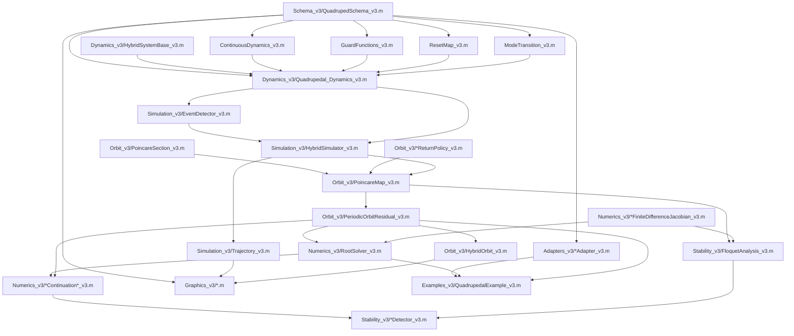

# Implementation and numerical workflow

This document traces one periodic-orbit computation from its initial input to
the hybrid trajectory, Poincare return, root correction, continuation, and
stability analysis. It also distinguishes the legacy prescribed-time solver
from the independent v3 event-driven implementation.

## Dependency graph



`HybridSystemBase_v3` is the generic contract. The quadruped is one assembly
of that contract; another biped or contact model can supply different flow,
guard, reset, transition, mode-validation, and admissibility callbacks without
changing the simulator, map, or numerical solvers.

## Legacy workflow versus v3

The legacy v2 root function
`SLIP_Quadruped/1_Dynamic_Frameworks/v2/Quadrupedal_ZeroFun_v2.m`
receives 13 initial-state entries, nine event-time unknowns, and seven model
parameters. It sorts the supplied touchdown, liftoff, and apex times, infers
contact from those intervals, integrates each prescribed segment, and includes
event-surface equations in the algebraic residual. Changing event order changes
the timing chart used by that root problem.

V3 does not call or modify that code. Its inputs are

\[
u=x(2{:}14),\qquad q_0,\qquad
p=[k_{l,b},k_{l,f},k_{s,b},k_{s,f},l_{l,b},l_{l,f},
rsla_b,rsla_f,j_{pitch},l_{com}]^T.
\]

There is no event-time vector. Starting from `(x0,q0)`, enabled guard roots
determine all event times and their order. Legacy saved data enter only through
the four explicit classes in `1_Dynamic_Frameworks/Adapters_v3/`.

## End-to-end quadruped entry point

[`QuadrupedalExample_v3.m`](../4_Solution_Management/Examples_v3/QuadrupedalExample_v3.m) performs
the executable workflow.

1. `resolveFixture` loads one saved v2 branch point as an initial guess.
2. `LegacyStateAdapter_v3.toV3Unknown` applies the exact old-to-new state
   permutation. `LegacyParameterAdapter_v3.toV3` applies either `v2-exact` or
   `semantic-rsla`; `LegacyModeAdapter_v3.toV3` converts the contact order.
3. `QuadrupedSchema_v3.shared` provides every index and name.
4. The example constructs `Quadrupedal_Dynamics_v3`,
   `HybridSimulator_v3`, the downward apex `PoincareSection_v3`, an explicit
   `EventCycleReturnPolicy_v3`, `SectionModeResolver_v3`,
   `PoincareMap_v3`, and `PeriodicOrbitResidual_v3`.
5. `RootSolver_v3.solve` optionally corrects the 13 continuous coordinates.
6. `PeriodicOrbitResidual_v3.createOrbit` packages the accepted execution in
   `HybridOrbit_v3`; optional stability calls `FloquetAnalysis_v3.analyze`.

`InitialUnknownPerturbation` exists for regression and solver studies. It
allows a converted fixture to be deliberately moved off its root so that a
test can demonstrate a genuine correction rather than only verifying an
already-converged stored seed.

## One event-driven hybrid segment

The mathematical state is `(t,x,q,p)`. One simulator iteration follows this
call sequence.

```text
HybridSimulator_v3.simulate
  -> EventDetector_v3.integrate
       -> system.activeGuards(t0,x0,q,p)
       -> ode45(@(t,x) system.flow(t,x,q,p))
            -> Quadrupedal_Dynamics_v3.flow
                 -> ContinuousDynamics_v3.evaluate
       -> ODE event callback
            -> Quadrupedal_Dynamics_v3.activeGuards
                 -> GuardFunctions_v3.descriptors
                 -> GuardFunctions_v3.attachFlowDerivatives
       -> earliest directional event and simultaneous batch
  -> system.reset(eventId,t_event,x-,q-,p)
       -> ResetMap_v3.apply
  -> system.transition(eventId,q-)
       -> ModeTransition_v3.apply
  -> Trajectory_v3.recordEvent and append post-reset sample
  -> restart integration from (t_event,x+,q+)
```

### Flow evaluation

[`ContinuousDynamics_v3.evaluate`](../1_Dynamic_Frameworks/Dynamics_v3/ContinuousDynamics_v3.m)
validates the canonical vectors, expands family parameters in
`[BL,BR,FL,FR]` order, computes hip geometry and stance compression, sums body
force and pitch torque, evaluates either the swing equation or fixed-foot
stance constraint for each leg, and returns the 14-vector `dxdt`. It does not
clamp negative force. `assertAdmissible` is called on accepted integration
samples and post-reset states, so an execution that has passed a liftoff
surface and retained a tensile stance leg is rejected.

### Guard arming and first-event selection

[`GuardFunctions_v3`](../1_Dynamic_Frameworks/Dynamics_v3/GuardFunctions_v3.m) creates all eight
named descriptors, but the current contact bit enables only touchdown or
liftoff for each leg. Touchdown has direction `-1`; liftoff has direction
`+1`. `attachFlowDerivatives` records the true Lie derivative `Dg*F`, including
the projected stance rate.

[`EventDetector_v3.integrate`](../1_Dynamic_Frameworks/Simulation_v3/EventDetector_v3.m) freezes
the active descriptor IDs during one smooth mode. A guard starting at zero is
unarmed until it first enters the pre-crossing interior; this prevents a reset
surface from immediately retriggering without adding artificial time. The ODE
solver stops at the earliest armed directional root. Other guards within the
event-value/time tolerances and with a consistent directional derivative join
the simultaneous batch. Priority only makes simultaneous reset application
deterministic; it is not a gait schedule.

### Reset, transition, and trajectory

[`ResetMap_v3.apply`](../1_Dynamic_Frameworks/Dynamics_v3/ResetMap_v3.m) leaves body position and
velocity continuous and projects only the affected massless-leg angular rate
onto zero horizontal foot velocity. [`ModeTransition_v3.apply`](../1_Dynamic_Frameworks/Dynamics_v3/ModeTransition_v3.m)
then toggles the event leg. The simulator records `x-`, `x+`, `q-`, `q+`, guard
name, time, and transversality in [`Trajectory_v3`](../1_Dynamic_Frameworks/Simulation_v3/Trajectory_v3.m).
Duplicate event times are retained when a state or mode jumps, giving
right-continuous post-event data without interpolating through a reset.

## From hybrid simulation to a Poincare map

[`PoincareSection_v3.apex`](../4_Solution_Management/PoincareSection_v3.m) defines

\[
h(x,p)=dy=0,\qquad \dot h=ddy<0.
\]

It never checks whether the legs are airborne. The private
`PoincareMap_v3.nextSectionCrossing` operation prevents immediate return in
three phases: leave the initial section, reach the opposite side to rearm,
then locate the next downward crossing. Every phase calls the complete hybrid
simulator, so contact events remain active.

[`PoincareMap_v3.evaluate`](../4_Solution_Management/PoincareMap_v3.m) repeatedly calls that
next-crossing operation. After each candidate, it passes the cumulative
right-continuous mode and automatically generated event history to the chosen
return policy:

- `FirstReturnPolicy_v3` accepts candidate one;
- `IteratedReturnPolicy_v3` accepts candidate `m`;
- `EventCycleReturnPolicy_v3` accepts the first candidate with mode closure
  and at least one touchdown and one liftoff for every model-described leg.

A rejected intermediate apex is recorded and integration continues. At a
section/contact coincidence, physical resets and transitions are processed
before the section record. Output includes period, all candidate crossings,
accepted index, return multiplicity, event and mode sequences, counts,
section-relative and cyclic signatures, coincidence records, transversality,
and admissibility margins.

## Periodic residual

[`PeriodicOrbitResidual_v3`](../4_Solution_Management/PeriodicOrbitResidual_v3.m)
reconstructs a 14-state section point from `u` by fixing `x(1)=0`. It projects
a copy onto the section, evaluates the accepted full-cycle map `P_C`, and
forms

\[
R(u,p,q)=
\begin{bmatrix}
P_C(x,q,p)_{[2,3,5{:}14]}-x_{[2,3,5{:}14]}\\
dy_{raw}
\end{bmatrix}.
\]

The 12 return equations omit horizontal translation and the section-normal
coordinate; the thirteenth equation is the phase condition evaluated on the
unprojected input. The discrete mode stays outside `u`. Invalid integration,
incomplete cycle, tensile stance, or failed mode closure is metadata for
structured trial rejection, not a fabricated finite physical residual.

## Root solving

[`RootSolver_v3.solve`](../3_Numerical_Continuation/1_Root_Solving/RootSolver_v3.m) first asks the residual's
`SectionModeResolver_v3` for local charts. It retains the supplied/previous
mode and only toggles guards near the section with directionally consistent
events. It does not enumerate all 16 quadruped modes unless an exhaustive
provider is explicitly requested.

For each candidate mode, `solveOne`:

1. scales the continuous unknowns and parameters;
2. evaluates and caches the baseline map using a solve-local key;
3. rejects nonfinite or invalid hybrid executions through `safeObjective`;
4. builds a Jacobian using `HybridFiniteDifferenceJacobian_v3` by default;
5. calls `fsolve` with the available Jacobian, or the custom damped
   Levenberg--Newton/trust-region corrector;
6. re-evaluates the final state and reports function, map, cache, invalid
   trial, and Jacobian counts.

The custom step solves

\[
(J^TJ+\lambda\,\operatorname{diag}d)s=-J^TR,
\]

clips `s` to the trust radius, and backtracks it. An invalid hybrid trial is
rejected and the step is reduced. A valid residual decrease expands the trust
region and reduces damping. Optional Broyden updates are used only while
topology remains compatible; a topology or reliability change forces a fresh
Jacobian.

[`FiniteDifferenceJacobian_v3`](../3_Numerical_Continuation/1_Root_Solving/FiniteDifferenceJacobian_v3.m)
is the smooth-function utility. It uses

\[
h_i=\sqrt{\epsilon}(1+|u_i|),
\quad J_i=\frac{R(u+h_ie_i)-R(u)}{h_i},
\]

or the central formula when requested, reusing the baseline. The hybrid
utility instead compares topology-compatible central estimates at several
scaled `h` and `h/2` values, selects the start of a stable plateau, and applies
Richardson extrapolation. One-sided topology-preserving estimates are labelled
piecewise smooth and unreliable as unique classical derivatives.

## Continuation

[`NumericalContinuation1D_v3.run`](../3_Numerical_Continuation/2_Continuation_Algorithms/NumericalContinuation1D_v3.m)
accepts a numeric parameter index or schema name. For every requested value it
copies `p`, changes only the active entry, solves from the preceding `u,q`, and
stores the full orbit, event/mode histories, signatures, counts, margins,
solver counters, schema, and optional Floquet result. A section-relative
signature, section mode, multiplicity, or coincidence change marks a hybrid
topology boundary even when the cyclic physical event sequence is unchanged.

[`PseudoArclengthContinuation_v3`](../3_Numerical_Continuation/2_Continuation_Algorithms/PseudoArclengthContinuation_v3.m)
first differentiates the extended residual with respect to `(u,mu)`. The
oriented null vector of this matrix is the predictor tangent. Its corrector
solves

\[
\begin{bmatrix}
R(u,p(\mu),q)\\
t^T((u,\mu)-(u_0,\mu_0))-ds
\end{bmatrix}=0.
\]

Failed correctors shrink `ds`. At a marked hybrid boundary the accepted orbit
is retained, the step shrinks, Jacobian reuse is cleared, and the stored
smooth tangent/Floquet result is explicitly unresolved. The incoming predictor
is used only internally to reach a neighboring smooth chart, where a new
classical tangent can be computed.

## Stability and bifurcations

[`FloquetAnalysis_v3.analyze`](../3_Numerical_Continuation/3_Bifurcation_Analysis/FloquetAnalysis_v3.m)
differentiates the same accepted full-cycle map on the section-tangent,
translation-reduced coordinates. The default topology-aware derivative
returns selected steps, error estimates, difference type, and per-column
reliability. Multipliers are eigenvalues of that reduced full-cycle matrix.

[`BifurcationDetector_v3`](../3_Numerical_Continuation/3_Bifurcation_Analysis/BifurcationDetector_v3.m) matches
finite reliable multipliers between compatible points and detects bracketed
crossings of `+1`, `-1`, or a complex-pair modulus through one. Nonfinite or
unreliable points break, rather than poison, multiplier tracks.
[`HybridBoundaryDetector_v3`](../3_Numerical_Continuation/3_Bifurcation_Analysis/HybridBoundaryDetector_v3.m)
separately reports grazing, event collision/insertion/deletion,
section/event coincidence, mode/multiplicity/signature change, and stance-force
admissibility loss. Those boundaries are not automatically smooth
bifurcations.

## Post-processing

[`HybridOrbit_v3`](../4_Solution_Management/HybridOrbit_v3.m) stores initial state/mode,
period, parameters, event/mode history, Poincare state, trajectory, and
stability. It contains no gait label. Files in [`2_Graphic_ToolBox/Graphics_v3`](../2_Graphic_ToolBox/Graphics_v3)
consume recorded modes, events, and dynamics diagnostics; they never reconstruct
contact from prescribed event-time inputs. Gait classification, if desired,
is a separate post-processing operation on event history.
