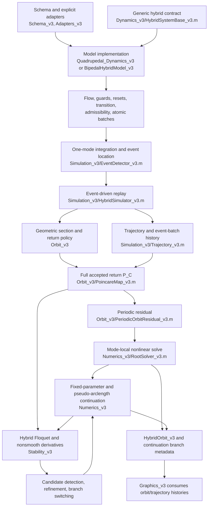
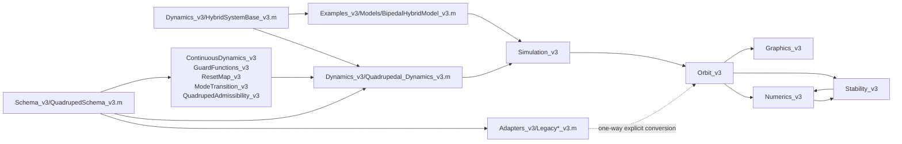

# SLIP Quadruped v3: methods, code structure, and end-to-end workflow

Historical artifact note: the test sources, aggregate test/analyzer runners
and generated test payloads referenced here were removed during the 2026-10-07
cleanup. Their commands and inventory entries are historical. Core numerical
services and research drivers remain; retained verification summaries are in
`Research_v3/Audits_v3` and current run instructions are in `README_v3.md`.

## 1. Scope of this document

This document describes the mathematical and software workflow implemented in
`SLIP_Quadruped_v3`. Paths below are relative to that directory. It explains
what each layer computes and how data move from an initial hybrid state
`(x0,q0,p)` through simulation, a full-cycle Poincare map, a periodic-orbit
solve, continuation, stability analysis, bifurcation refinement, and branch
switching.

This is a methods and architecture document, not a numerical-validation
certificate. The presence of an algorithm or test harness does not establish
that a particular physical quadruped orbit, bifurcation, switched branch, or
Floquet spectrum has been validated. Executed production results, test output,
parameter ranges, convergence tables, and unresolved physical searches belong
in `Docs_v3/Round4_Production_Validation_Report_v3.md`. The pre-change baseline
is recorded separately in `Docs_v3/Round4_Prechange_Test_Report_v3.md`.

## 2. Architectural view

The framework realizes a hybrid dynamical system

\[
  \mathcal H=(Q,X,F,G,\Delta),
\]

where `Q` is a discrete mode set, `X` is a continuous state space,
\(F_q\) is the flow in mode \(q\), \(G\) is the family of directional guard
surfaces, and \(\Delta\) is the family of reset maps. Event order is an output
of integration. It is not prescribed by a gait label, a timetable, or a root
unknown.

### 2.1 Architecture diagram



### 2.2 Dependency graph

The generic numerical classes depend on interfaces and metadata, not on the
quadruped schema. Quadruped-specific indexing terminates at the model and its
explicit adapters.



The apparent two-way relation between `Numerics_v3` and `Stability_v3` is at
the workflow level: continuation may call a supplied stability analyzer, while
branch switching in `Numerics_v3/BranchSwitching_v3.m` consumes a refined
critical point produced in `Stability_v3`. The base simulation and map layers
do not depend on either analysis layer.

### 2.3 Directory responsibilities

| Directory | Responsibility |
|---|---|
| `Schema_v3` | Canonical quadruped state, parameter, leg, mode, event, and root-chart metadata |
| `Adapters_v3` | Explicit state/parameter/mode/event conversion at the legacy/v3 boundary |
| `Dynamics_v3` | Generic hybrid contract and quadruped flow, guards, resets, mode transitions, admissibility, and batch semantics |
| `Simulation_v3` | One-mode event location, event-driven replay, trajectory storage, and cycle-level event clustering |
| `Orbit_v3` | Geometric sections, return policies, local section-mode charts, Poincare maps, periodic residuals, and orbit records |
| `Numerics_v3` | Ordinary and hybrid finite differences, nonlinear root solving, continuation, and branch switching |
| `Stability_v3` | Floquet analysis, symmetry/nonsmooth derivatives, smooth-candidate detection/refinement, and hybrid-boundary detection |
| `Graphics_v3` | Construction, resampling, animation, trajectory, GRF, and periodic-orbit views from v3 orbit/trajectory data |
| `Examples_v3` | Reproducible quadruped and second-model factories and search/continuation harnesses |
| `Tests_v3` | Source contracts, synthetic numerical tests, and separately identified production-model tests |

## 3. Canonical quadruped model

### 3.1 Schema

`Schema_v3/QuadrupedSchema_v3.m` is the only production source of quadruped
coordinate, parameter, leg, mode, and event ordering.

The state is

\[
x=\begin{bmatrix}
x&\dot x&y&\dot y&\phi&\dot\phi&
\alpha_{BL}&\dot\alpha_{BL}&
\alpha_{BR}&\dot\alpha_{BR}&
\alpha_{FL}&\dot\alpha_{FL}&
\alpha_{FR}&\dot\alpha_{FR}
\end{bmatrix}^{\mathsf T}\in\mathbb R^{14}.
\]

The ten-parameter vector is

\[
p=\begin{bmatrix}
k_{l,b}&k_{l,f}&k_{s,b}&k_{s,f}&
l_{l,b}&l_{l,f}&r_{sla,b}&r_{sla,f}&j_{pitch}&l_{com}
\end{bmatrix}^{\mathsf T}.
\]

Leg and mode order is always

```text
[BL, BR, FL, FR]
```

with `q(i)=0` for swing and `q(i)=1` for stance. The event catalog is

```text
[BL_TD, BL_LO, BR_TD, BR_LO, FL_TD, FL_LO, FR_TD, FR_LO].
```

For back legs \(s_i=-l_{com}\), and for front legs
\(s_i=1-l_{com}\). Back/front scalar parameters are expanded to four-leg
vectors by `QuadrupedSchema_v3.expandParameters`.

The root chart removes horizontal translation. Its production defaults are:

- translation index: `x` (state index 1);
- phase index: `dy` (state index 4);
- 13 unknown coordinates: state indices `2:14`;
- 12 independent periodic equations: state indices `[2,3,5:14]`;
- Floquet section-tangent indices: `[2,3,5:14]`.

Thus 12 return equations plus one section equation form a square 13-variable
root problem. Event times and the discrete mode are not continuous unknowns.

### 3.2 Model assembly

`Dynamics_v3/Quadrupedal_Dynamics_v3.m` derives from
`Dynamics_v3/HybridSystemBase_v3.m` and delegates to these model-owned
components:

| Mathematical object | Code path and method |
|---|---|
| \(F_q(t,x,p)\) | `Dynamics_v3/ContinuousDynamics_v3.m`, `evaluate` |
| guard descriptors | `Dynamics_v3/GuardFunctions_v3.m`, `descriptors` |
| \(\Delta_i(x^-,q^-,p)\) | `Dynamics_v3/ResetMap_v3.m`, `apply` / `applyBatch` |
| \(q^+=T(q^-,i)\) | `Dynamics_v3/ModeTransition_v3.m`, `apply` / `applyBatch` |
| physical domain | `Dynamics_v3/QuadrupedAdmissibility_v3.m`, `evaluate` / `assertAdmissible` |
| simultaneous event semantics | `Quadrupedal_Dynamics_v3.resolveEventBatch` |

`Quadrupedal_Dynamics_v3.flow`, `activeGuards`, `reset`, and `transition`
expose these components through the generic base contract. The simulator knows
nothing about trot, bound, gallop, pronk, or any other gait name.

### 3.3 Continuous dynamics

In `ContinuousDynamics_v3.evaluate`, define

\[
\theta_i=\phi+\alpha_i,
\qquad
h_i=y+s_i\sin\phi,
\]

where \(h_i\) is hip height. For a regular stance leg,

\[
r_i=\frac{h_i}{\cos\theta_i},
\qquad
c_i=l_{0,i}-r_i,
\qquad
f_i=k_{l,i}c_i.
\]

Only stance legs contribute axial force. The force and pitching moment used by
the code are

\[
\mathbf f_i=
\begin{bmatrix}-f_i\sin\theta_i\\f_i\cos\theta_i\end{bmatrix},
\qquad
\tau_i=s_i f_i\cos\alpha_i,
\]

\[
F_x=\sum_i (\mathbf f_i)_x,
\quad
F_y=\sum_i (\mathbf f_i)_y,
\quad
\tau=\sum_i\tau_i.
\]

With the nondimensional mass and gravity convention used by this model,

\[
\ddot x=F_x,
\qquad
\ddot y=F_y-1,
\qquad
\ddot\phi=\frac{\tau}{j_{pitch}}.
\]

When `j_pitch=Inf`, the implementation sets \(\ddot\phi=0\).

For each swing leg, `ContinuousDynamics_v3.swingLegAcceleration` implements

\[
\begin{aligned}
\ddot\alpha_i={}&-\ddot\phi
-\frac{F_x\cos\theta_i+F_y\sin\theta_i}{l_{0,i}}
-\frac{s_i}{l_{0,i}}\ddot\phi\sin\alpha_i\\
&+\frac{s_i}{l_{0,i}}\dot\phi^2\cos\alpha_i
-\frac{k_{s,i}}{l_{0,i}^2}(\alpha_i-r_{sla,i}).
\end{aligned}
\]

The torsional term therefore vanishes at \(\alpha_i=r_{sla,i}\), and front
and back legs may have distinct \(l_0,k_l,k_s,r_{sla}\).

For a stance leg the foot is fixed. `backConstraintRates` and
`frontConstraintRates` in `ContinuousDynamics_v3.m` solve the differentiated
fixed-foot constraint for the kinematically consistent \(\dot\alpha_i\) and
\(\ddot\alpha_i\). These projected rates replace the stored angular-rate
coordinate in the returned flow. The separate front/back functions encode the
corresponding hip offsets; callers should use `stanceConstraintRates` rather
than duplicate their generated expressions.

### 3.4 Guard functions

`GuardFunctions_v3.legValues` defines the uncompressed-leg contact surface

\[
g_i(x,p)=y+s_i\sin\phi-l_{0,i}\cos(\phi+\alpha_i).
\]

For leg \(i\):

- in swing, touchdown is enabled with direction `-1`;
- in stance, liftoff is enabled with direction `+1`.

The nominal directional derivative is

\[
\dot g_i=\dot y+s_i\cos\phi\,\dot\phi
+l_{0,i}\sin(\phi+\alpha_i)(\dot\phi+\dot\alpha_i).
\]

`Quadrupedal_Dynamics_v3.guardFunctions` calls
`GuardFunctions_v3.attachFlowDerivatives`, which recomputes the Lie derivative
from the actual returned flow. This matters in stance because the fixed-foot
constraint can replace the raw stored \(\dot\alpha_i\).

Each descriptor carries an ID, name, value, direction, priority, leg index,
leg name, event kind, and metadata. Direction and current mode select the
event; no fixed touchdown or liftoff ordering is embedded.

### 3.5 Reset and mode update

`ResetMap_v3.apply` leaves body position and velocity continuous and changes
only the affected leg-rate coordinate. Let

\[
N_i=\dot x-s_i\sin\phi\,\dot\phi
+(\dot y+s_i\cos\phi\,\dot\phi)\tan\theta_i,
\qquad
D_i=\frac{h_i}{\cos^2\theta_i}.
\]

The projected post-event leg rate is

\[
\dot\alpha_i^+=-\dot\phi-\frac{N_i}{D_i}.
\]

Singular geometry is rejected. `ModeTransition_v3.apply` then sets the
affected contact bit to one at touchdown or zero at liftoff. It checks that the
event was enabled in the pre-event mode.

## 4. Event-driven simulation: exact call workflow

The production entry point is

```matlab
[trajectory,result] = simulator.simulate(system,x0,q0,p,tspan,options);
```

The detailed workflow is as follows.

### Step 1: validate the input and initialize storage

1. `Simulation_v3/HybridSimulator_v3.m`, `simulate`, checks the time span and
   hybrid-system interface.
2. Model methods `validateState`, `validateMode`, and `validateParameter`
   enforce the active model schema.
3. `Simulation_v3/Trajectory_v3.m` is created with the initial sample and
   mode.
4. If the model supplies `assertAdmissible`, the initial state is checked in
   the `accepted-state` context.

### Step 2: freeze the mode and integrate its flow

1. `HybridSimulator_v3.simulate` calls
   `Simulation_v3/EventDetector_v3.m`, `integrate`.
2. `EventDetector_v3` obtains the active descriptor set through
   `system.activeGuards(t,x,q,p)` and freezes that set for the current smooth
   segment.
3. The configured ODE solver, `ode45` by default, integrates
   `system.flow(t,x,q,p)` with the current `q` held constant.
4. Every active physical guard and the optional stopping-section condition is
   terminal for this smooth segment. Guards that start at zero are initially
   unarmed; they become armed only after the trajectory enters the correct
   pre-crossing interior. This prevents an artificial zero-time retrigger.

### Step 3: select the first event and form a simultaneous batch

1. The ODE solver returns its earliest terminal event time.
2. `EventDetector_v3.clusterAtEvent` reevaluates all active descriptors at
   that state.
3. An additional guard enters the same batch if its value is within
   `EventValueTolerance`, or if `abs(g/dgdt)` is within
   `SimultaneousTimeTolerance`, and its Lie derivative has the requested
   direction.
4. Descriptors are sorted deterministically for representation, but sorting
   alone does not define their physics.

This is the local event batch at one integration restart. Longer-orbit event
clusters are constructed later by `Simulation_v3/EventCluster_v3.m`.

### Step 4: resolve the batch atomically at model level

`HybridSimulator_v3` calls

```matlab
[xplus,qplus,batchInfo] = ...
    system.resolveEventBatch(eventIds,tEvent,xminus,qminus,p);
```

The simulator never assumes that scalar resets commute.

- `HybridSystemBase_v3.resolveEventBatch` is the generic compatibility
  fallback. It applies reset/transition pairs in supplied order and labels
  `batchInfo.semantics` as `ordered-sequential-fallback`.
- `Quadrupedal_Dynamics_v3.resolveEventBatch` implements
  `commuting-independent-leg-resets`. A batch may contain at most one event
  per leg. It compares forward and reverse scalar orders with the explicit
  component batch maps, verifies that each reset changes only its leg-rate
  coordinate, and records errors and tolerances in `batchInfo`. It fails
  rather than silently declaring noncommuting operations independent.
- A model with coupled impacts may override the same method with one coupled
  impulse solve. The simulator records its declared semantics without
  inventing intermediate scalar-reset states.

### Step 5: post-reset validation and right-continuous restart

1. `HybridSimulator_v3` validates `xplus` dimension and finiteness.
2. For the quadruped it invokes `assertAdmissible(...,'post-reset',context)`;
   the event IDs are supplied so guard and post-event mode consistency can be
   checked.
3. One complete batch record stores time, all members, \(x^-\), \(x^+\),
   \(q^-\), \(q^+\), priorities, semantics, and model diagnostics.
4. Scalar event-history entries point back to the batch index. If meaningful
   scalar traces exist, they are retained; an atomic coupled reset need not
   manufacture unphysical intermediate states.
5. Integration restarts from the right-continuous pair `(xplus,qplus)`.

The loop repeats until final time, a requested stopping section, event limits,
or a zero-time/Zeno safeguard terminates it.

### Step 6: returned trajectory

`Trajectory_v3` contains:

- piecewise-smooth `time`, `state`, and `mode` samples;
- repeated time samples across jumps;
- flattened `event_type`, `event_time`, and structured `event_history`;
- structured `event_batches` with atomic semantics;
- a termination record and propagated admissibility metadata.

The event and mode histories are the raw material for later gait
classification. `HybridOrbit_v3` deliberately has no stored `gait_type`.

## 5. Physical admissibility

`Dynamics_v3/QuadrupedAdmissibility_v3.m` separates four contexts:

1. `ode-stage`: reports a configurable small event-surface overshoot and does
   not throw merely because a transient Runge--Kutta stage passed a guard;
2. `accepted-state`: strict checks on returned integration samples and event
   states;
3. `post-reset`: strict checks plus event/mode/guard consistency when event
   metadata are supplied;
4. `section-return`: strict checks on the accepted return state.

For each leg,

\[
\theta_i=\phi+\alpha_i,
\qquad
h_i=y+s_i\sin\phi,
\qquad
h_{foot,i}^{swing}=h_i-l_{0,i}\cos\theta_i.
\]

For swing legs the unilateral clearance condition is

\[
h_{foot,i}^{swing}\ge -\varepsilon_{swing}.
\]

For stance legs the evaluator computes

\[
r_i=h_i/\cos\theta_i,
\qquad
c_i=l_{0,i}-r_i,
\]

and requires

\[
c_i\ge-\varepsilon_{tension},
\qquad
r_i>r_{min}.
\]

It does not divide by \(\cos\theta_i\) for a swing leg when determining
admissibility. Optional model assumptions check front/back hip clearance,
torso-segment ground intersection, finite geometry, complementarity, reset
guard consistency, and downward leg orientation. With the guard convention
above, the complementarity residual is the penetration of a swing foot below
its surface or a stance configuration onto the wrong side of its active
contact surface.

The structured report includes per-leg clearances, compressions, lengths,
hip and torso margins, complementarity residuals, active tolerances, validity,
and failure reasons. `HybridSimulator_v3` accumulates minimum margins;
`PoincareMap_v3`, `PeriodicOrbitResidual_v3`, `HybridOrbit_v3`, both
continuation classes, and `Stability_v3/HybridBoundaryDetector_v3.m` propagate
them. Physical-domain losses are hybrid boundaries, not smooth Floquet
bifurcations.

## 6. Event clusters over an accepted cycle

`Simulation_v3/EventCluster_v3.m` groups physical events whose times fit
inside an adaptive tolerance

\[
\varepsilon_t(t_a,t_b)=\max\left(
\varepsilon_{abs},\;\varepsilon_{rel}\max(1,|t_a|,|t_b|),\;
128\,\mathrm{eps}(\max(1,|t_a|,|t_b|))\right).
\]

For every cluster it stores members, names, center time, maximum internal
spread, relative cycle phase, and section coincidence. For a complete cycle it
also reports ordered and cyclic cluster signatures and
`minimum_intercluster_gap`, computed between cluster centers rather than
between individual simultaneous events.

This distinction is essential:

- zero spread inside a persistent BL/BR or four-leg cluster is structural
  simultaneity, not by itself an event collision;
- two distinct but close clusters are an `event_cluster_approach`, not yet a
  collision;
- a collision is the merger of previously distinct cluster centers;
- comparison of adjacent reports diagnoses persistent clusters, split, merge,
  and collision;
- contact/section coincidence is recorded separately.

`HybridBoundaryDetector_v3` reports these nonsmooth boundaries as
`persistent_simultaneous_cluster`, `event_cluster_collision`,
`event_cluster_split`, `event_cluster_merge`, and
`section_cluster_coincidence`. It also reports swing-foot penetration, torso
contact, invalid leg geometry, and complementarity loss. None is automatically
classified as a saddle-node, period doubling, or Neimark--Sacker bifurcation.

## 7. Poincare section and full-cycle map

### 7.1 Geometric section

`Orbit_v3/PoincareSection_v3.m` represents a general section

\[
h(x,p)=0
\]

with a directional Lie-derivative condition. The quadruped apex factory uses

\[
h(x,p)=\dot y,
\qquad
\dot h=\ddot y<0.
\]

`PoincareSection_v3.apex(schema.State.dy,...)` projects the normal coordinate
to `dy=0` and checks the downward crossing from `system.flow`. It does not
require all legs to be airborne and does not prescribe `q` at the section.
Grounded apexes are therefore representable whenever they satisfy the same
geometric and admissibility conditions.

If no analytic section derivative or projection is supplied, the class uses
central coordinate differences for \(\nabla h\) and a normal Newton retraction

\[
x_{k+1}=x_k-
\frac{h(x_k,p)}{\nabla h(x_k,p)^{\mathsf T}\nabla h(x_k,p)}
\nabla h(x_k,p).
\]

### 7.2 Leaving and rearming the section

`Orbit_v3/PoincareMap_v3.m`, `evaluate`, first projects and validates the
initial state. For each candidate return, its private
`nextSectionCrossing` executes three simulator phases:

1. leave the initial section to a small signed arm level;
2. cross the opposite arm level to rearm the section;
3. return to level zero in the requested direction.

Contact guards remain active during every phase. With
`ProcessGuardsAtStop=true`, a contact event coincident with the section is
processed and represented as a right-continuous hybrid state; it is not hidden
by the stopping condition.

### 7.3 Return policies

Section geometry and cycle acceptance are independent.

- `Orbit_v3/FirstReturnPolicy_v3.m` accepts the first valid directional
  crossing.
- `Orbit_v3/IteratedReturnPolicy_v3.m` accepts a requested iterate \(P^m\).
- `Orbit_v3/EventCycleReturnPolicy_v3.m` is the quadruped default. It accepts
  only when the final right-continuous mode equals the initial mode and every
  leg has at least one touchdown and one liftoff in the cumulative physical
  event history.
- `Orbit_v3/ReturnPolicyBase_v3.m` defines the model-independent candidate
  contract.

Intermediate apexes are retained as candidates and ignored when the event
cycle is incomplete. The accepted map is therefore the policy-selected
full-cycle return

\[
x^+=P_C(x,q,p),
\]

not necessarily the first geometric apex map. Returned metadata include
period, candidate count, accepted index/return multiplicity, event and mode
sequences, per-leg counts, cyclic signature, section-relative signature,
cluster signature, transversality, and physical margins.

The section-relative signature starts at the chosen section chart. Thus
`FR_LO<Apex` and `Apex<FR_LO` remain distinguishable even when their cyclically
canonical event words are identical.

### 7.4 Local section-mode resolution

At continuation or root correction, a contact event may move through the
section and change the right-continuous section mode.
`Orbit_v3/SectionModeResolver_v3.m` begins with the previous accepted mode and
adds only modes obtained by applying section-near, directionally consistent
guards and their combinations. `Quadrupedal_Dynamics_v3.adjacentMode` toggles
the corresponding leg chart on either side of the guard. Exhaustive all-mode
enumeration exists only as an explicit debugging method; it is not the
production default.

## 8. Periodic-orbit residual and nonlinear root solve

### 8.1 Residual construction

`Orbit_v3/PeriodicOrbitResidual_v3.m` reconstructs a full state from the
unknown vector, projects it to the section, evaluates the full policy-selected
map, and forms

\[
R_{per}(u;p,q)=
P_C(x(u),q,p)_{I_{per}}-x(u)_{I_{per}}.
\]

For the production quadruped,

\[
R(u;p,q)=
\begin{bmatrix}
P_C(x,q,p)_{[2,3,5:14]}-x_{[2,3,5:14]}\\
\dot y_{raw}
\end{bmatrix}\in\mathbb R^{13}.
\]

The last equation is the apex phase constraint evaluated on the unprojected
raw state. Horizontal position is a translation gauge and is canonicalized to
zero by the system. The residual rejects a return that fails required discrete
closure; event timing and event order remain outputs of `PoincareMap_v3`.

`PeriodicOrbitResidual_v3.createOrbit` packages an accepted solution as
`Orbit_v3/HybridOrbit_v3.m`, including event, mode, cluster, return-policy,
stability, topology, and physical-margin metadata, but no gait label.

### 8.2 Discrete modes are resolved outside the continuous solver

`Numerics_v3/RootSolver_v3.m` requests local candidates from the residual and
`SectionModeResolver_v3`. Each candidate mode is a separate continuous solve.
The mode is never passed to `fsolve` or Newton as a real-valued unknown. The
solver selects the converged candidate with the best residual and reports all
attempts and rejection reasons.

### 8.3 Default hybrid finite-difference Jacobian

Unless explicitly replaced, `RootSolver_v3` constructs
`Numerics_v3/HybridFiniteDifferenceJacobian_v3.m`. For coordinate \(i\), a
candidate physical step is

\[
h_i=r_j(1+|u_i|),
\]

where \(r_j\) is selected from a configurable grid. The default grid is
`[1e-3,3e-4,1e-4,3e-5,1e-5,3e-6]`.

For each candidate it evaluates \(u\pm h_i e_i\) and
\(u\pm h_i e_i/2\). If all trials are valid and topology compatible,

\[
D_h=\frac{R(u+h_ie_i)-R(u-h_ie_i)}{2h_i},
\qquad
D_{h/2}=\frac{R(u+h_ie_i/2)-R(u-h_ie_i/2)}{h_i},
\]

and optional Richardson extrapolation gives

\[
D_i=\frac{4D_{h/2}-D_h}{3}.
\]

The estimator compares \(D_h\) and \(D_{h/2}\), selects the first reliable
step plateau, and stores selected steps, error estimates, map counts, and
per-column reliability. Compatibility checks include cycle completion,
discrete closure, return multiplicity, cyclic event signature,
section-relative signature, and guard/section transversality.

At a chart boundary, forward and backward one-sided Richardson estimates are
retained separately whenever each side has an internally compatible
(h,h/2) stencil. Their cyclic, section-relative, and cluster signatures and
return multiplicities are stored with the columns. These directional matrices
are diagnostic Bouligand limits; neither is promoted to a unique classical
derivative merely because one side matches the right-continuous baseline
chart. The code does not average incompatible one-sided limits.

`Numerics_v3/FiniteDifferenceJacobian_v3.m` remains the dimension-independent
ordinary forward/central alternative. Its default scale is

\[
h_i=\sqrt{\epsilon_{mach}}(1+|u_i|).
\]

### 8.4 Nonlinear algorithms

`RootSolver_v3` supports `fsolve` and a damped Levenberg--Newton trust-region
method. In `auto` mode it can evaluate both available candidates. Function
values are cached by state, and the report distinguishes function calls, map
calls, cache hits, invalid trials, and Jacobian evaluations.

The in-house step solves

\[
\left(J^{\mathsf T}J+\lambda\,\mathrm{diag}(d)\right)s
=-J^{\mathsf T}R,
\]

clips \(s\) to a trust radius, and backtracks until the residual merit
\(\tfrac12 R^{\mathsf T}R\) decreases on a valid hybrid return. A Broyden
update is optional and is used only across compatible topology. Invalid
hybrid trials are rejected, not converted into finite penalty residuals.

## 9. Continuation

### 9.1 Simple parameter continuation

`Numerics_v3/NumericalContinuation1D_v3.m` fixes one selected component
\(\mu=p_j\) at each requested value and solves

\[
R(u;p(\mu),q)=0
\]

using the preceding accepted state and mode as the next initial guess. Each
point stores the full parameter, period, event/mode histories, return policy,
return multiplicity, cyclic and section-relative signatures, event clusters,
physical margins, solver statistics, and optional stability. A failed solve is
stored separately; no event ordering or timing is supplied to the solver.

### 9.2 Pseudo-arclength continuation

`Numerics_v3/PseudoArclengthContinuation_v3.m` frees one scalar parameter and
uses \(z=[u;\mu]\). With component scale \(s\), tangent \(t\), base point
\(z_k\), and arclength step \(\Delta s\), its corrector solves

\[
G(z)=
\begin{bmatrix}
R(u;p(\mu),q)\\
t^{\mathsf T}\left((z-z_k)./s\right)-\Delta s
\end{bmatrix}=0.
\]

The extended hybrid Jacobian

\[
A=\frac{\partial R}{\partial [u;\mu]}
\]

is computed by the configured Jacobian, hybrid finite differences by default.
The scaled null vector is the last right singular vector of \(A\,\mathrm{diag}(s)\).
Orientation is chosen from the previous tangent or requested initial parameter
direction. A unique classical, reliable derivative is required to claim a
smooth tangent.

The predictor is corrected across local mode candidates. Step size grows after
success and shrinks after failure. If section mode, return multiplicity, event
signature, or event clusters mark a topology boundary, the orbit may remain an
accepted branch point, but its smooth tangent and Floquet matrix are marked
unresolved. The implementation carries the incoming predictor locally until a
neighboring compatible chart can supply a new tangent.

## 10. Floquet analysis and hybrid derivatives

### 10.1 Classical full-cycle derivative

`Stability_v3/FloquetAnalysis_v3.m` differentiates the complete accepted hybrid
map \(P_C\), including variations in guard times and all resets. It does not
differentiate only a continuous state-transition matrix and does not silently
replace `EventCycleReturnPolicy_v3` by a first-apex return.

In section coordinates \(\eta\),

\[
M=D P_C(\eta_*),
\qquad
M_{:i}\approx
\frac{P_C(\eta_*+h_ie_i)-P_C(\eta_*-h_ie_i)}{2h_i},
\]

with the hybrid step-refinement machinery above. The Floquet multipliers are

\[
\lambda_j\in\operatorname{eig}(M),
\]

and the reported stability margin is

\[
m=1-\max_j|\lambda_j|.
\]

The default classical analysis requires compatible cyclic, section-relative,
and event-cluster signatures, fixed return multiplicity, cycle and mode
closure, adequate guard
and section transversality, no section/contact coincidence, finite columns, and
a converged central derivative. At an exact contact/section coincidence, or if
a central stencil enters `LO_FR<Apex` on one side and `Apex<LO_FR` on the
other, the result is a hybrid chart boundary. Available one-sided columns and
the adjacent section signatures remain diagnostics, but the analysis does not
declare one reliable classical matrix.

### 10.2 Symmetry-restricted derivative

`Stability_v3/SymmetrySubspace_v3.m` represents linear actions
\(\rho(g)\) and computes

\[
\operatorname{Fix}(G)=
\{\eta:\rho(g)\eta=\eta\ \text{for every supplied generator}\}.
\]

For a supplied basis \(B\), `FloquetAnalysis_v3` differentiates perturbations

\[
\eta=Bz
\]

and returns the reduced block. `Stability_v3/SymmetryRestrictedFloquet_v3.m`
labels the result `symmetry-restricted-classical`, checks that the base belongs
to the requested subspace, and verifies preservation of the baseline cluster
signature on the selected (h,h/2) stencil. It also measures the component of
the returned perturbation transverse to (operatorname{span}(B)); excessive
transverse leakage rejects a falsely invariant block. Its multipliers belong to that symmetry block; they are not the
unrestricted spectrum. The quadruped helper constructs the left/right fixed
section-tangent basis from the canonical schema.

### 10.3 Bouligand event-order set

When a simultaneous cluster splits under transverse perturbation,
`Stability_v3/EventClusterDerivative_v3.m` can enumerate supplied admissible
event orders \(\sigma\), or walk each scalar reset and transition of an actual
hybrid model and filter the permutations with a supplied one-sided guard-cone
predicate. It computes the corresponding one-sided matrices

\[
\mathcal B P_C=\{M_\sigma:\sigma\text{ is an admissible local ordering}\}.
\]

It stores every limit and all pairwise matrix differences. For model-based
enumeration, merely supplying a Boolean predicate is not treated as proof that
the guard-time cones were resolved. The predicate must return affirmative
resolution metadata; otherwise reset-order commutativity remains a diagnostic
only and no full-cycle classical derivative is claimed. A unique classical
matrix is returned only if every reliable admissible ordering limit agrees
within the configured tolerance and the cone resolution is explicit.
Incompatible matrices are never averaged, and the eigenvalues of an
arbitrarily selected ordering are not called “the” Floquet multipliers.

## 11. Bifurcation candidates, refinement, and branch switching

### 11.1 Candidate detection is only bracketing

`Stability_v3/BifurcationDetector_v3.m` matches multiplier tracks between
continuation points using eigenvalue distance and, when available,
eigenvector overlap. It brackets sign changes of

\[
\lambda-1,
\qquad
\lambda+1,
\qquad
|\lambda|-1
\]

for real unit-multiplier, period-doubling, and nonreal conjugate-pair
Neimark--Sacker candidates. Unreliable or topology-incompatible intervals are
excluded by default. A bracket is a candidate, not a classification.

### 11.2 Moore--Spence and multiplier refinements

`Stability_v3/BifurcationRefiner_v3.m` first rejects candidates marked with
unreliable Floquet data, incompatible topology, a section/contact boundary, or
unresolved simultaneous-event ordering. It also requires an explicit candidate
multiplier consistent with the requested augmented system: (+1) for the
Moore--Spence system, (-1) for period doubling, and a nonreal multiplier for
Neimark--Sacker refinement. This prevents a corrector from silently converging
to a different critical eigenpair than the bracket supplied by the detector.

For a unit multiplier of the periodic residual \(F(u,\mu)=0\), it solves

\[
F(u,\mu)=0,
\qquad
F_u(u,\mu)v=0,
\qquad
c^{\mathsf T}v-1=0.
\]

It obtains a left null vector \(w\) from the SVD and normalizes
\(w^{\mathsf T}v=1\). The fold coefficients are

\[
a=w^{\mathsf T}F_\mu,
\qquad
b=\frac12w^{\mathsf T}F_{uu}[v,v].
\]

The code labels a local fold only if the augmented solve, residual/null tests,
singular-value test, and both \(|a|\) and \(|b|\) thresholds pass. If
\(a\approx0\), the result explicitly requires additional
pitchfork/transcritical/symmetry information.

For period doubling it solves

\[
F(u,\mu)=0,
\qquad
(DP_C(u,\mu)+I)v=0,
\qquad
c^{\mathsf T}v-1=0.
\]

For a Neimark--Sacker candidate it solves a real two-vector representation of
the complex eigenproblem on the unit circle, verifies a nonzero imaginary part
and conjugate partner, and reports the critical angle. When several complex
pairs exist, the initial pair is selected by distance to the supplied candidate
multiplier, with critical-vector overlap used to resolve a spectral tie. It
does not continue an invariant torus.

The refiner's residual and map Jacobian objects are configurable. Ordinary
central finite differences are accepted only when the caller explicitly sets
`AssumeSmoothCallbacks=true`. Otherwise the refiner requires a
`HybridFiniteDifferenceJacobian_v3` and complete execution metadata for every
stencil point. The refinement class does not make a physical validation claim
by itself.

### 11.3 Branch switching

`Numerics_v3/BranchSwitching_v3.m` constructs signed predictors

\[
u_+=u_*+\varepsilon v,
\qquad
u_-=u_*-\varepsilon v.
\]

Before constructing them, the switcher again verifies the refined critical
multiplier: (+1) is required for unit/symmetry switching and (-1) for a
period-doubling switch. Missing or mismatched critical-type evidence fails
closed.

For a unit-multiplier point it corrects the periodic residual with a local
pseudo-arclength/branch-separation equation. Optional parent deflation can be
applied. A child is accepted only if the nonlinear solve converges, its
periodic residual is small, it is separated from the parent, the full hybrid
cycle and mode close, physical admissibility is explicitly present and true,
and topology metadata are recorded.

For period doubling it solves

\[
P_C^2(u,\mu)-u=0
\]

and separately enforces

\[
\|P_C(u,\mu)-u\|_\infty>\varepsilon_{P1}.
\]

The last inequality prevents a period-one solution from being relabeled as a
period-two child. Accepted children can be passed to
`PseudoArclengthContinuation_v3` by `continueSwitchedBranch` or
`continuePeriodDoubledBranch`.

When linear symmetry actions are supplied, `switchSymmetryBreaking` computes
their common fixed space, projects the critical vector into its orthogonal
symmetry-breaking complement, and rejects a vanishing projected component.
The projected direction—not the original mixed vector—defines both predictors
and the branch-separation equation. The result records the fixed/breaking
bases and projectors, critical-vector representations, and parent/child
stabilizers. It never infers a pitchfork solely from \(\lambda=1\).

## 12. Second-model extensibility demonstration

`Examples_v3/Models/BipedalHybridModel_v3.m` derives directly from
`HybridSystemBase_v3`; it does not use or inspect `QuadrupedSchema_v3`.
Its state and parameter dimensions differ from the quadruped:

\[
x_b=[y,\dot y]^{\mathsf T},
\qquad
p_b=[g,k,c,e_{td},J_{lo}]^{\mathsf T}.
\]

Modes `0/2` are left/right flight and modes `1/3` are left/right stance.
Flight and stance flows are

\[
\ddot y=-g,
\qquad
\ddot y=-g-ky-c\dot y,
\]

respectively. The active guard is \(y=0\): touchdown crosses downward and
liftoff crosses upward. Touchdown applies

\[
\dot y^+=e_{td}\dot y^-,
\]

and liftoff applies

\[
\dot y^+=\dot y^-+J_{lo}.
\]

Touchdown loss, stance damping, and the liftoff impulse make the model
non-energy-conservative. The discrete mode alternates left and right legs.
`Examples_v3/Models/BipedStrideReturnPolicy_v3.m` ignores the intermediate
step apex and accepts only after one TD/LO for each leg and mode closure.

`Examples_v3/Models/BipedalHybridExample_v3.m` wires this model to the same
`HybridSimulator_v3`, `PoincareMap_v3`, `PeriodicOrbitResidual_v3`,
`RootSolver_v3`, `NumericalContinuation1D_v3`, and `FloquetAnalysis_v3` used by
the quadruped. It is a compact infrastructure demonstration, not a migration
of a complete external biped project and not evidence for any quadruped
physical case.

## 13. Configurable numerical tolerances

The following are code defaults, not universal accuracy guarantees. Examples
and tests may override them, and production convergence must be established by
external step/tolerance studies.

| Component | Selected defaults |
|---|---|
| `HybridSimulator_v3` / `EventDetector_v3` | `RelTol=1e-9`, `AbsTol=1e-11`, event value `1e-8`, event time `1e-10`, simultaneous time `1e-8`, directional derivative `1e-10`, arming `1e-9` |
| `PoincareSection_v3` | value `1e-9`, derivative `1e-10`, at most 10 projection iterations |
| `PoincareMap_v3` | arm `1e-7`, max return time 20, max 32 candidate crossings, max 1000 physical events |
| `EventCluster_v3` | absolute time `1e-10`, relative time `128*eps`, collision-center tolerance `1e-5`; section coincidence defaults to the absolute tolerance |
| `QuadrupedAdmissibility_v3` | swing penetration `1e-8`, stance tension `1e-8`, minimum leg length `1e-8`, complementarity `1e-8`, post-reset guard `1e-7`, ODE-stage surface `1e-5` |
| `RootSolver_v3` | function `1e-9`, step `1e-10`, residual acceptance `1e-7`, up to 150 iterations / 5000 evaluations |
| `HybridFiniteDifferenceJacobian_v3` | relative candidates `[1e-3,3e-4,1e-4,3e-5,1e-5,3e-6]`, maximum relative estimate error `5e-2`, minimum guard/section transversality `1e-7/1e-8` |
| `PseudoArclengthContinuation_v3` | initial step `0.02`, min/max `1e-5/0.2`, growth/shrink `1.25/0.5` |
| `FloquetAnalysis_v3` | stability threshold `1e-6`, minimum guard/section transversality `1e-7/1e-8`, maximum supplied-subspace leakage `1e-6` |
| `BifurcationRefiner_v3` | residual acceptance `1e-8`, singular value `1e-7`, refined multiplier and nondegeneracy `1e-6`, initial candidate-pair distance `5e-2` |
| `BranchSwitching_v3` | predictor `1e-3`, residual `1e-8`, parent separation and period-one exclusion `1e-6`, critical multiplier `1e-4`, symmetry `1e-8` |

Admissibility switches and margins are properties of
`QuadrupedAdmissibility_v3`. Solver, continuation, and stability options are
constructor properties in their respective classes. A reported value is
meaningful only together with the active options stored in the result.

## 14. Migration and legacy-preservation strategy

The v3 framework is independent. Existing v1/v2 files are not edited, and v3
production components do not call legacy zero functions. Migration is an
explicit boundary operation through `Adapters_v3`:

- `LegacyStateAdapter_v3.m` maps old leg-coordinate order to canonical
  `[BL,BR,FL,FR]` for the full 14-state vector and the 13 root coordinates;
- `LegacyModeAdapter_v3.m` maps old `[BL,FL,BR,FR]` contact order to v3;
- `LegacyEventAdapter_v3.m` maps numeric IDs through event names rather than
  assuming the two catalogs share IDs;
- `LegacyParameterAdapter_v3.m` maps seven old parameters to ten v3
  parameters and requires an explicit `semantic-rsla` or `v2-exact` policy.

For legacy \([k,k_s,J,l,osa,l_b,k_r]\), the linear stiffness conversion is

\[
k_{l,b}=\frac{2kk_r}{1+k_r},
\qquad
k_{l,f}=\frac{2k}{1+k_r},
\]

with equal old front/back torsional stiffness and leg length. `semantic-rsla`
activates `osa` as both rest swing angles; `v2-exact` sets both rest angles to
zero because the old production dynamics parsed but did not use `osa`.

A migrated workflow should therefore:

1. load a legacy branch point without altering its file;
2. convert state, parameter, mode, and any events with explicit adapters;
3. save the conversion policy and `QuadrupedSchema_v3.metadata()`;
4. use the converted state only as a v3 root initial guess;
5. rediscover all event times and ordering with `HybridSimulator_v3`;
6. validate the full event cycle and physical margins before accepting it;
7. store the result as `HybridOrbit_v3` and use `Graphics_v3`, which consumes
   the trajectory and event/mode histories rather than an old packed `P`
   vector or event-time guesses.

The concrete seed-conversion factory is
`Examples_v3/QuadrupedalExample_v3.m`. The continuation/search harness is
`Examples_v3/QuadrupedalContinuationStudy_v3.m`. Their existence describes a
reproducible workflow; only executed results in the Round 4 production report
establish which physical cases were actually found.

## 15. Entry points and evidence boundary

The historical `run_all_tests_v3.m` established paths deterministically, ran
`Tests_v3`, and wrote machine-readable and human-readable test artifacts.
That runner and the test sources were removed during cleanup. The original
`.github/workflows/slip-quadruped-v3-tests.yml` recipe referenced those removed
runners; its historical presence does not establish current CI success.
Current research execution and audit reproduction instructions are in
`README_v3.md`; retained verification records are in `Research_v3/Audits_v3`.

The evidence chain for any production claim should include, at minimum:

1. the exact initial state, mode, parameter, return policy, and active
   tolerances;
2. residual reduction and solver/Jacobian statistics;
3. event, mode, section-relative, cyclic, and cluster signatures;
4. cycle completion and physical-admissibility margins;
5. for Floquet data, an external step-grid convergence table and compatible
   topology on every accepted stencil;
6. for a bifurcation, a reliable refined critical system and the required
   nondegeneracy or conjugacy tests;
7. for a switched branch, parent separation, full-cycle closure,
   admissibility, residual, topology, and (for period two) period-one
   exclusion.

Without that evidence, the correct label is “implemented,” “synthetically
tested,” “candidate,” or “unresolved,” not “physically validated.”
