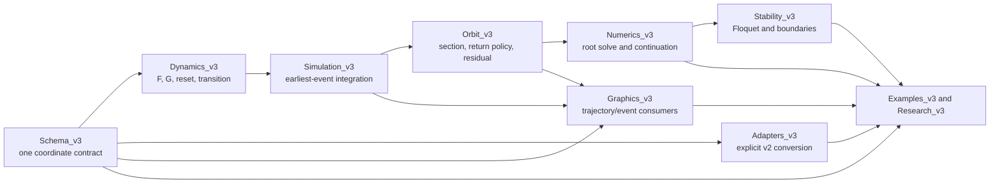

# SLIP Quadruped v3

`SLIP_Quadruped_v3` is an additive hybrid-periodic-orbit framework. It does
not replace the legacy v1/v2 simulators, continuation scripts, graphics, or
saved data. Legacy vectors enter v3 only through explicit adapters.

The October 2026 research campaign adds independent physical/energy charts,
fixed-parameter family continuation, BL-marked return charts, primitive-cycle
and state-based gait diagnostics, parent-only pronk discovery, and a v3 GUI.
The requested single PIP-rooted P1/P2 network remains unresolved. Read
[`Final_Research_Status_v3.md`](Docs_v3/Final_Research_Status_v3.md) for actual
executed results, restricted attachment certificates, failures, and scope.
Historical Round4 reports describe an earlier checkout; they are not current
network or all-tests-pass certificates.

The October 7 cleanup retains numerical code, research checkpoints, figures,
GUI examples and scientific audits. Unit tests, their CI workflow, temporary
check scripts and caches were removed. Historical verification summaries live
in `Research_v3/Audits_v3`; the cleanup manifest records removals and lossless
MAT compression. The legacy `SLIP_Quadruped/` reference remains unchanged.

The framework models

\[
\mathcal H=(Q,X,F,G,\Delta),
\]

with mode-dependent flow \(\dot x=F_q(t,x,p)\), directional guards,
event-specific resets, and separate discrete transitions. It never receives a
gait name or a prescribed contact order.

## Architecture



The principal runtime path is:

```text
(x0,q0,p)
  -> Quadrupedal_Dynamics_v3.flow
  -> EventDetector_v3: earliest enabled directional guard
  -> ResetMap_v3(x-,q-,event)
  -> ModeTransition_v3(q-,event)
  -> Trajectory_v3 event/mode history
  -> PoincareMap_v3: next section crossing
  -> ReturnPolicyBase_v3: accept or continue
  -> PeriodicOrbitResidual_v3
  -> RootSolver_v3 / continuation / Floquet analysis
```

The complete dependency graph and function-by-function execution trace,
including the legacy prescribed-event workflow, are in
[`Implementation_Workflow_v3.md`](Docs_v3/Implementation_Workflow_v3.md).
The permanent file-by-file implementation and verification record is
[`Final_Implementation_Audit_v3.md`](Docs_v3/Final_Implementation_Audit_v3.md).

## Canonical schema

`Schema_v3/QuadrupedSchema_v3.m` is the sole source of coordinate, leg,
event, parameter, and root-chart ordering.

The 14-state vector is

```text
1 x       2 dx       3 y         4 dy
5 phi     6 dphi     7 alphaBL   8 dalphaBL
9 alphaBR 10 dalphaBR 11 alphaFL 12 dalphaFL
13 alphaFR 14 dalphaFR
```

The contact mode is `q=[qBL;qBR;qFL;qFR]`, with `0` for swing and `1`
for stance. The event catalog is:

```text
1 BL_TD  2 BL_LO  3 BR_TD  4 BR_LO
5 FL_TD  6 FL_LO  7 FR_TD  8 FR_LO
```

The ten parameters are:

```text
1 k_l_b   2 k_l_f   3 k_s_b   4 k_s_f   5 l_l_b
6 l_l_f   7 rsla_b  8 rsla_f  9 j_pitch 10 l_com
```

Family parameters expand in `[BL,BR,FL,FR]` order. The 13 root coordinates
are states `2:14`; state 1 is the horizontal-translation gauge. Independent
flight-apex periodic and section-tangent coordinates are `[2,3,5:14]`, and
state 4 is the phase coordinate. In a stance mode, one stored angular rate per
stance leg is dependent. `QuadrupedPhysicalChart_v3` retracts these rates and
provides `12-nnz(q)` independent apex/translation coordinates. Full displayed
state vectors are retained for serialization and complete closure checks.

See
[`State_Parameter_Event_Conventions_v3.md`](Docs_v3/State_Parameter_Event_Conventions_v3.md)
for the complete tables and validation rules.

## Hybrid quadruped model

For leg \(i\), let

\[
s_i\in\{-l_{com},1-l_{com}\},\qquad
\theta_i=\phi+\alpha_i,\qquad
L_i=\frac{y+s_i\sin\phi}{\cos\theta_i}.
\]

The stance compression and axial force are
\(\delta_i=l_{0,i}-L_i\) and \(\lambda_i=k_{l,i}\delta_i\). Negative
compression is not clamped; accepted tensile stance states are reported as
inadmissible. Body acceleration follows

\[
\ddot x=-\sum_iq_i\lambda_i\sin\theta_i,
\quad
\ddot y=\sum_iq_i\lambda_i\cos\theta_i-1,
\quad
\ddot\phi=\frac{\sum_iq_i s_i\lambda_i\cos\alpha_i}{j_{pitch}}.
\]

The swing equation is

\[
\ddot\alpha_i=
-\ddot\phi
-\frac{F_x\cos\theta_i+F_y\sin\theta_i}{l_i}
-\frac{s_i}{l_i}\ddot\phi\sin\alpha_i
+\frac{s_i}{l_i}\dot\phi^2\cos\alpha_i
-\frac{k_{s,i}}{l_i^2}(\alpha_i-rsla_i).
\]

Touchdown and liftoff use the same geometric surface

\[
g_i=y+s_i\sin\phi-l_{0,i}\cos(\phi+\alpha_i)=0,
\]

with mode enablement and crossing direction distinguishing the events. A
massless-leg reset leaves body position and velocity continuous and projects
the affected leg rate onto zero horizontal foot velocity. Full derivations,
the biped limit, stance constraint, and diagnostics are in
[`Quadruped_EOM_v3.md`](Docs_v3/Quadruped_EOM_v3.md).

## Section crossing versus cycle completion

The apex section is geometrically

\[
h(x,p)=dy=0,\qquad \dot h=ddy<0.
\]

It imposes no flight or fixed-mode condition. `PoincareMap_v3` first finds a
directional section crossing, then asks an explicit return policy whether the
crossing completes the desired map:

- `FirstReturnPolicy_v3` accepts the first crossing;
- `IteratedReturnPolicy_v3` accepts crossing \(m\);
- `EventCycleReturnPolicy_v3` accepts the first right-continuous crossing
  with mode closure and at least one touchdown and liftoff for every leg;
- `BLMarkedApexReturnPolicy_v3` additionally fixes a declared BL touchdown
  occurrence and the last qualifying preceding downward apex in a local chart.

Direct quadruped maps default to `EventCycleReturnPolicy_v3`; generic hybrid
systems default to `FirstReturnPolicy_v3`. An explicitly supplied policy is
never replaced later by residual or stability construction.

The event-cycle policy permits intermediate apexes and imposes no event order.
Its event coverage is separate from primitive-period validation.
`PrimitiveCycleCheck_v3` checks complete interior histories; repeating a cycle
does not become a new double-flight gait. `RephaseHybridOrbit_v3` records chart
transport and returns a predictor requiring physical correction/replay.
At a section/contact coincidence, physical transitions are processed once and
the post-event section mode is stored. All candidate crossings, accepted
multiplicity, event counts, signatures, transversality, and coincidence data
are returned. See
[`Poincare_and_Cycle_Definition_v3.md`](Docs_v3/Poincare_and_Cycle_Definition_v3.md).

## Periodic root problem

With `u=x(2:14)` and the horizontal gauge fixed at `x(1)=0`, the square
relative-periodic residual is

\[
R(u,p,q)=
\begin{bmatrix}
\Pi\big(P_C(x,q,p)-x\big)\\
dy_{raw}
\end{bmatrix},
\qquad \Pi=[2,3,5{:}14].
\]

It retains 12 displayed periodicity equations and one phase equation. These
are not independent in every stance chart, or along an energy family. The
discrete section mode remains outside the numerical unknown vector. A local
section-mode resolver retains the previous chart and toggles only guards near
the section with consistent directions; exhaustive `allModes()` is available
only as an explicit diagnostic.

`RootSolver_v3` supplies state/parameter scaling, solve-local map caching,
structured invalid-trial rejection, fsolve and damped trust-region Newton
paths, counters, and optional Jacobian/Broyden reuse. Event times and event
order are never root unknowns.

`EnergyFamilyResidual_v3` instead uses the physical chart, removes a closure
equation through a regular energy pivot, and enforces the family energy.
`FixedParameterContinuation_v3` appends energy as an explicit family coordinate
while all ten physical parameters remain fixed. Every accepted root must
still close every physical state coordinate within `1e-8`. Parent symmetry
restrictions (`none`, `left-right`, `pronk`) are explicit and validated.

## Continuation and stability

`NumericalContinuation1D_v3` accepts a parameter index or name and corrects
each requested value from the preceding solution. `PseudoArclengthContinuation_v3`
augments the periodic residual with

\[
t^T\big((u,p)-(u_0,p_0)\big)-ds=0.
\]

Accepted points store states, parameters, section mode, period, full event
history, cycle-return policy, return multiplicity, candidate/accepted apex
indices, both topology signatures, event counts, transversality, solver
statistics, Floquet data, and schema metadata. Topology changes are marked and
trigger step reduction instead of a fabricated smooth tangent.

`HybridFiniteDifferenceJacobian_v3` compares central derivatives at \(h\) and
\(h/2\), selects a coordinate-scaled plateau, optionally applies Richardson
extrapolation, and validates full-cycle topology. One-sided results are marked
piecewise smooth and are not called unique classical derivatives. Hybrid
Floquet analysis also requires explicit closure, completion, multiplicity,
signature, and transversality evidence; omitted metadata cannot certify a
reliable derivative.

`FloquetAnalysis_v3` differentiates the accepted full-cycle map on the
section-tangent, translation-reduced chart. `BifurcationDetector_v3` reports
`unit_multiplier_candidate`, `period_doubling_candidate`, and
`Neimark_Sacker_candidate` only on reliable topology-compatible intervals.
`HybridBoundaryDetector_v3` separately reports nonsmooth boundaries. Details
are in
[`Stability_and_Bifurcation_v3.md`](Docs_v3/Stability_and_Bifurcation_v3.md).

## Legacy migration

Use the four classes under `Adapters_v3`; never insert an old vector directly
into v3. `LegacyParameterAdapter_v3` requires an explicit policy:

```matlab
newU = LegacyStateAdapter_v3.toV3Unknown(oldU);
newQ = LegacyModeAdapter_v3.toV3(oldQ);
[newP, conversion] = LegacyParameterAdapter_v3.toV3(oldP, 'v2-exact');
```

`v2-exact` discards the formerly inactive neutral swing-angle value, while
`semantic-rsla` activates it as both family rest angles. The complete
permutations and conversion equations are in
[`Migration_v2_to_v3.md`](Docs_v3/Migration_v2_to_v3.md).

The historical restoration of 70 legacy files and its then-current hash audit
are recorded in
[`Legacy_Restoration_Audit_v3.md`](Docs_v3/Legacy_Restoration_Audit_v3.md).
The current protected checkout already lacks their old path. Two unchanged
baseline tests asserted that historical path; see the current research
report and independently verified initial protected-tree manifest.

## Graphics

`Graphics_v3` consumes `Trajectory_v3` or `HybridOrbit_v3`, the ten-parameter
schema, recorded modes/events, and dynamics diagnostics. Contact phases are
not reconstructed from event-time inputs. The toolbox supports classic and UI
axes, invisible/headless construction, simple/detailed animation, optional
video export, diagnostics-based GRFs, and reset-safe right-continuous
resampling.

## Research execution and GUI

All production fixtures, configurations, checkpoints, branch references,
figures, and reports live under v3. Source SHA256 values and the starting Git
commit are retained. The scheduled legacy model and the autonomous first-root
model are compared explicitly; accepting an autonomous state does not assert
that its old scheduled period or contact cycle was reproduced.

From the repository root:

```sh
python3 SLIP_Quadruped_v3/Research_v3/run_campaign.py --config validation --stage all --resume
python3 SLIP_Quadruped_v3/Research_v3/run_campaign.py --config full --stage all --resume
python3 SLIP_Quadruped_v3/Research_v3/run_campaign.py --verify-only
python3 SLIP_Quadruped_v3/Research_v3/generate_research_index.py --config full
python3 SLIP_Quadruped_v3/Research_v3/generate_family_reports.py
python3 SLIP_Quadruped_v3/Research_v3/generate_research_report.py
```

Resume retains completed and terminal bounded-stop JSONs; fixed-family partial checkpoints replay
their last accepted point before continuing. A parent-only rerun versions prior
artifacts and recomputes frozen predictions. Stage locks, timestamped logs,
configuration fingerprints, numerical stops, and cumulative process-wall
charges are retained. To regenerate the independent replay index, with the v3
root and Drivers_v3 on the MATLAB path, run `ExportResearchEvidence_v3`.
After a parent-only stage, `AuditPronkAttachments_v3` independently reassesses
saved trajectories and matrices against the unchanged numerical evidence gates.

Open `SLIP_Quadruped_GUI_v3` from MATLAB. Ten physical parameter fields, explicit
return-policy and BL occurrence controls, shared correction/continuation,
restricted/full Floquet options, plotting, recording, and checkpoint controls
are documented in [`GUI_Parity_v3.md`](Docs_v3/GUI_Parity_v3.md). Fixed-energy
family continuation and physical-parameter scans are distinct UI actions.

[`Research_Evidence_Schemas_v3.md`](Docs_v3/Research_Evidence_Schemas_v3.md)
documents the typed graph, full replay index and compact catalog schemas.
Graph links to an artifact are references; only its explicit evidence status
determines whether a connection is supported.

## Validation scope and current limitations

The converted PK fixture closes and is also tested after a deliberate
continuous-state perturbation so that the solver performs a genuine root
correction. A second executed regression continues that orbit from
`k_l_b=k_l_f=10` to `k_l_f=10.02`; the corrected orbit has distinct
front/back touchdown and liftoff times while retaining one event of each type
per leg and discrete closure. Full-cycle Floquet differentiation is exercised
on analytic event-free and two-apex hybrid systems; the default quadruped
example leaves the substantially more expensive quadruped Floquet calculation
disabled.

The available asymmetric v2 roadmap fixtures were generated with prescribed
event times and the legacy touchdown-rate treatment. For sampled BE/BG/FE/FG/
GE/GG/HE/HG points, v3 inserts contact crossings that the prescribed schedule
suppresses; subsequent rate projection and force validation can expose a
tensile stance or singular stance constraint. Weakening force admissibility or
ignoring those guards would hide a physical/model incompatibility. Thus actual
asymmetric-orbit behavior is tested, but the clause requiring direct use of an
available non-pronking legacy fixture remains an explicit migration gap rather
than a claimed successful replay. The executed suite converted and exercised a
representative positive-clearance BG point and verified its structured tensile
stance rejection, so the historical regression evidence also records this limitation.

The stance acceleration implementation preserves validated legacy symbolic
fixed-foot formulas; it is not a general constrained-mechanics DAE solver.
At grazing, event collision, or topology-changing boundaries, a unique
classical return-map derivative may not exist. V3 reports that loss of
smoothness and does not manufacture a Floquet matrix or continuation tangent.

## Run

From the repository root:

```matlab
v3 = fullfile(pwd, 'SLIP_Quadruped_v3');
addpath(genpath(v3));

% Explicitly converts the fixture, closes a full contact cycle, and refines.
[orbit, report, framework] = QuadrupedalExample_v3(struct('Refine', true));

% Optional graphics; no dialog is required.
views = QuadrupedalGraphicsExample_v3(orbit, ...
    'Visible', 'off', 'PlayAnimation', false);

% Independently replay all retained accepted research solutions.
replay = ExportResearchEvidence_v3();
assert(replay.failed_replay_count == 0);
```

All new branch data carry state, parameter, leg, event, and schema-version
metadata. Gait and primitive-cycle diagnostics are attached only after
trajectory validation; labels never constrain the dynamics or root solve.
`Research_v3/audit_commands.sh` replays physical solutions and refreshes the
evidence indexes and reports. Historical test/analyzer counts are retained in
`Research_v3/Audits_v3`; the former test runners were removed. Output paths must
resolve inside v3, and entry points restore their caller’s MATLAB path.
