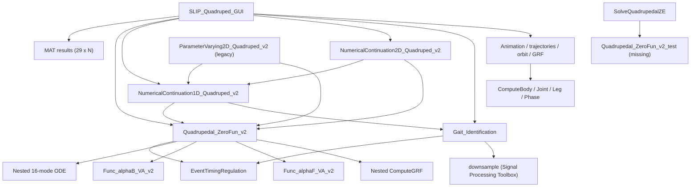

# SLIP Model Zoo Round 1 repository and scientific audit

This is the historical Round 1 audit at the commit and environment recorded
below. During the 2026-10-07 cleanup, the repository characterization tests
were removed. `tools/runRound1Audit.m` remains a runnable numerical audit;
it records that the former characterization suite is intentionally absent.
Historical test inventories and proposed regression checks below are not
claims that those test files remain in the working tree.

## 1. Executive summary

Round 1 completed the static baseline/audit and added an isolated MATLAB
execution harness plus characterization tests. No production `.m` file and no
`.mat`, `.fig`, or `.mlx` research artifact was edited.

The ordinary periodic-orbit formulation has 22 unknowns and 22 residuals.
Infinite pitch inertia adds one equation; an optional event-pair constraint
adds two. The continuation correctors append another equation, so their
Levenberg–Marquardt problems are overdetermined. Numerical rank, residual
norms, solver convergence, ODE cost, profiling, and graphics remain explicitly
blocked because MATLAB is not installed on this host.

The highest-impact source-confirmed findings are:

- `SolveQuadrupedalZE` calls a missing residual entry point.
- Event-time enforcement prechecks 8 equations but its 9-variable inner solve
  targets 9.
- Coincident touchdown/liftoff means no stance in dynamics but a full-period
  stance, and potentially undefined variables, in gait classification.
- The accepted neutral swing-angle parameter is not used by the dynamics.
- Both symbolic derivation scripts contain execution-blocking symbol,
  dimension, or copy/paste defects.

The detailed model and schema records are
[`model-audit-round1.md`](model-audit-round1.md) and
[`data-schema-round1.md`](data-schema-round1.md). The bounded execution plan
is [`performance-baseline-round1.md`](performance-baseline-round1.md).

## 2. Environment and exact commands

### Observed environment

| Item | Value |
|---|---|
| Repository root | `/Users/nanyoujiayu/Documents/GitHub/SLIP_Model_Zoo` |
| Commit | `2c106101383ecee1b2a9d695efe09fbd72d5718a` |
| Branch | `main` |
| OS | macOS 26.5.2 (`25F84`), Darwin arm64 |
| MATLAB | Not found on `PATH` |
| Octave | Not found on `PATH` |
| Wolfram Engine | Not found on `PATH` |
| MATLAB release/toolboxes | Not observable because MATLAB is absent |
| Display | No `DISPLAY`, `WAYLAND_DISPLAY`, or `MIR_SOCKET` advertised |
| Audit RNG | Static inspection only used no randomness; prepared harness uses `rng(314159,'twister')` |
| Auxiliary reader | Python 3.12 with SciPy 1.15.1, read-only MAT inspection |

The host static audit used these command families:

```sh
git rev-parse HEAD
git branch --show-current
git status --short --branch
rg --files
rg -n PATTERN SLIP_Quadruped
wc -l FILES
file RESEARCH_ARTIFACTS
shasum -a 256 RESEARCH_ARTIFACTS
unzip -l SLIP_Quadruped/1_Dynamic_Frameworks/QuadrupedalSystemDynamics.mlx
xmllint --format EXTRACTED_LIVE_SCRIPT_XML
python3 -c "from scipy.io import loadmat; ..."
command -v matlab
command -v octave
git diff --check
```

The original MATLAB audit plan, which could not run on the Round 1 host, was
prepared in `tools/runRound1Audit.m`:

- `checkcode` over every `.m`;
- `testsuite`/`run` over `tests/round1` (historical; removed during cleanup);
- `which(name,'-all')` for all requested entry points and the stale target;
- `matlab.codetools.requiredFilesAndProducts`;
- bounded residual/full-stride/root/continuation/gait/graphics/MAT-catalog
  operations;
- multi-step finite-difference Jacobian and row/column scaling analysis;
- pre/post reference-artifact hashing.

Run the retained numerical audit as follows. It excludes the removed
characterization suite and reports that omission explicitly:

```sh
matlab -batch "addpath('tools'); report=runRound1Audit();"
```

The dependency harness uses MATLAB's documented
[`requiredFilesAndProducts`](https://www.mathworks.com/help/matlab/ref/matlab.codetools.requiredfilesandproducts.html).
Production `fsolve` usage requires Optimization Toolbox according to the
official [`fsolve` documentation](https://www.mathworks.com/help/optim/ug/fsolve.html);
`downsample` is documented under
[Signal Processing Toolbox](https://www.mathworks.com/help/signal/ref/downsample.html);
and symbolic scripts require
[Symbolic Math Toolbox](https://www.mathworks.com/help/symbolic/sym.syms.html).

## 3. Initial Git state

Initial status:

```text
## main...origin/main
?? SLIP_Model_Zoo_Round1_Audit_Prompt.md
```

There were no tracked modifications. The audit prompt was already untracked
and was treated as user-owned input.

## 4. Source inventory and classification

The relevant tree contains 21 MATLAB source files (14,638 source lines), one
Live Script, nine MAT branches, two FIG references, and two pre-existing
documentation files:

```text
SLIP_Quadruped/
├── 1_Dynamic_Frameworks/
│   ├── QuadrupedalSystemDynamics.mlx
│   ├── SystemDynamics_Lagrangian.m
│   ├── SystemDynamics_Projection.m
│   ├── Readme.text
│   └── v2/
│       ├── Func_alphaB_VA_v2.m
│       ├── Func_alphaF_VA_v2.m
│       ├── Quadrupedal_ZeroFun_v2.m
│       └── SolveQuadrupedalZE.m
├── 2_Graphic_ToolBox/SLIP_Quadrupedal_Graphics/GraphicFunctions/
│   ├── ComputeBodyGraphics.m
│   ├── ComputeJoint_LegLA.m
│   ├── ComputeLegGraphics.m
│   ├── ComputePhaseDiagram.m
│   ├── OutputCLASS.m
│   ├── SLIP_Animation_Quad.m
│   ├── SLIP_GRF_Quad.m
│   ├── SLIP_PeriodicOrbit_Quad.m
│   └── SLIP_Trajectories_Quad.m
├── 3_Numerical_Continuation/1_Continuation_Algorithm/
│   ├── NumericalContinuation1D_Quadruped_v2.m
│   ├── NumericalContinuation2D_Quadruped_v2.m
│   └── ParameterVarying2D_Quadruped_v2.m
├── 4_Solution_Management/
│   ├── EventTimingRegulation.m
│   └── Gait_Identification.m
├── P1_Breaking_Symmetries_Leads_to_Diverse_Qudrupedal_Gaits/1_Roadmap/
│   ├── 1_PK_BD.fig
│   ├── 2_HB_GP.fig
│   ├── BD1_20_2_{BE,BG,FE,FG,GE,GG,HE,HG}.mat
│   └── PK_20_2.mat
├── README.md
└── SLIP_Quadruped_GUI.m
```

Legend: `S` = statically inspected, `E` = executed in MATLAB, `T` = directly
covered by a new test, `P` = profiled. Every row is `S=yes`, `E=no`, and
`P=no`; the common execution/profile blocker is `MATLAB_NOT_FOUND`.

### Runtime, derivation, GUI, and tooling sources

| File | Classification | Purpose / public API | Inputs → outputs | Direct dependencies | Side effects | T |
|---|---|---|---|---|---|---|
| `1_Dynamic_Frameworks/SystemDynamics_Lagrangian.m` | Symbolic derivation, experimental/broken | Lagrangian swing and stance generators | Workspace symbols → generated `.m` files | Symbolic Math Toolbox | `clc`, `clear`, generated files, console | No |
| `1_Dynamic_Frameworks/SystemDynamics_Projection.m` | Symbolic derivation, experimental/broken | Projection-based swing/stance generators | Workspace symbols → generated `.m` files | Symbolic Math Toolbox | `clc`, `clear`, generated files, console | No |
| `1_Dynamic_Frameworks/QuadrupedalSystemDynamics.mlx` | Symbolic derivation/reference | Live Script experiments | Live Script cells → embedded output/files | MATLAB Live Editor, Symbolic Math Toolbox | Unknown until execution | Hash only |
| `1_Dynamic_Frameworks/v2/Func_alphaB_VA_v2.m` | Generated production code | Back-leg stance velocity/acceleration | 16-vector → `dalphaB,ddalphaB` | Elementary math | None | Yes, FD test prepared |
| `1_Dynamic_Frameworks/v2/Func_alphaF_VA_v2.m` | Generated production code | Front-leg stance velocity/acceleration | 16-vector → `dalphaF,ddalphaF` | Elementary math | None | Yes, FD test prepared |
| `1_Dynamic_Frameworks/v2/Quadrupedal_ZeroFun_v2.m` | Production runtime | Hybrid stride and periodic residual | `X,E,Para[,constraints]` or `z,Para` → residual, `T,Y,P,GRFs,Y_EVENT` | `ode45/ode15s`, event regulation, generated functions; `fsolve` unless `skipSolve` | CPU; warning/solver console; no file output | Yes, dimensions prepared |
| `1_Dynamic_Frameworks/v2/SolveQuadrupedalZE.m` | Stale/legacy solver wrapper | Root solve from a 29-vector | `input` → `x,fval,exitflag` | `fsolve`, missing `Quadrupedal_ZeroFun_v2_test` | Solver console | Entry resolution only |
| `2_Graphic_ToolBox/.../ComputeBodyGraphics.m` | Visualization code | Torso patch geometry | joint position, `lb` → vertices/faces | MATLAB graphics math | None | No |
| `2_Graphic_ToolBox/.../ComputeJoint_LegLA.m` | Visualization/kinematics | Joint, leg length/angle trajectories | `t,y,P` → geometry arrays | Independent contact predicate | None | No |
| `2_Graphic_ToolBox/.../ComputeLegGraphics.m` | Visualization code | Leg spring mesh | vectors/length/angle → vertices/faces | MATLAB geometry | None | No |
| `2_Graphic_ToolBox/.../ComputePhaseDiagram.m` | Visualization code | Contact phase-bar geometry | normalized phase, `P` → patches/text positions | Independent event comparisons | None until caller draws | No |
| `2_Graphic_ToolBox/.../OutputCLASS.m` | GUI/visualization base class | Shared update timing properties/API | object state | MATLAB class system | Pause/timing through subclasses | No |
| `2_Graphic_ToolBox/.../SLIP_Animation_Quad.m` | Visualization code | Animation construct/update/record | `T,Y,P,...` → object | compute helpers, graphics, video/export | Figures, GIF/video/PDF files | No |
| `2_Graphic_ToolBox/.../SLIP_GRF_Quad.m` | Visualization code | GRF plot construct/update | `T,GRFs,target` → object | MATLAB graphics | Figure mutation | No |
| `2_Graphic_ToolBox/.../SLIP_PeriodicOrbit_Quad.m` | Visualization code | Phase portrait construct/update | `Y,position,target,color` → object | MATLAB graphics | Figure mutation | Harness smoke test prepared |
| `2_Graphic_ToolBox/.../SLIP_Trajectories_Quad.m` | Visualization code | State trajectory plots | `T,Y,targets` → object | MATLAB graphics | Figure mutation | No |
| `3_Numerical_Continuation/.../NumericalContinuation1D_Quadruped_v2.m` | Production continuation/persistence | Pseudo-arclength branch tracing | two 22-seeds, 7-parameters, radius/options → `results,flags,info` | residual, gait, `fsolve`, graphics callbacks | Logs, checkpoints, figures, pauses, callbacks | Capped harness prepared |
| `3_Numerical_Continuation/.../NumericalContinuation2D_Quadruped_v2.m` | Production parameter scan/persistence | Parameter-indexed branch continuation | seeds/parameters/targets/options → reports/branches | 1-D continuation, residual, `fsolve`, MAT I/O, `RandStream` | Directories, `cd`, MAT/report/checkpoint files | No |
| `3_Numerical_Continuation/.../ParameterVarying2D_Quadruped_v2.m` | Legacy compatibility/parameter scan | Older single-parameter driver | seeds/parameter key/target → MAT branch | residual, 1-D continuation, current-directory MAT discovery | Loads/saves/deletes in current directory | No |
| `4_Solution_Management/EventTimingRegulation.m` | Production solution management | Circular event normalization | 9- or 22-vector → same shape | `mod` | None | Yes |
| `4_Solution_Management/Gait_Identification.m` | Production solution management | Single/branch gait classification | 22-row solution/branch → label/abbr/color/line | event regulation, `downsample` | Console diagnostic; large temporary arrays | Indirect only |
| `SLIP_Quadruped_GUI.m` | Production GUI, orchestration, persistence | `SLIP_Quadruped_GUI` | User interaction/MAT branches → UI/solver/continuation/artifacts | Whole source tree, globals, all major APIs, UI/graphics, random functions | `addpath`, figures/UI, current-folder reads/writes, exports, MAT saves | Entry resolution only |

All nine graphics files are listed individually above; the shortened
`2_Graphic_ToolBox/...` prefix expands to
`2_Graphic_ToolBox/SLIP_Quadrupedal_Graphics/GraphicFunctions/`.
All three continuation paths expand under
`3_Numerical_Continuation/1_Continuation_Algorithm/`.

### Reference data and documentation

| File | Classification | Static inspection | Execution/render status |
|---|---|---|---|
| `P1.../1_Roadmap/BD1_20_2_BE.mat` | Example/reference branch, 443 columns | Level-5 MAT; `results` schema and hash checked | Not run in MATLAB |
| `P1.../1_Roadmap/BD1_20_2_BG.mat` | Example/reference branch, 474 columns | Same | Not run |
| `P1.../1_Roadmap/BD1_20_2_FE.mat` | Example/reference branch, 228 columns | Same | Not run |
| `P1.../1_Roadmap/BD1_20_2_FG.mat` | Example/reference branch, 212 columns | Same | Not run |
| `P1.../1_Roadmap/BD1_20_2_GE.mat` | Example/reference branch, 200 columns | Same | Not run |
| `P1.../1_Roadmap/BD1_20_2_GG.mat` | Example/reference branch, 277 columns | Same | Not run |
| `P1.../1_Roadmap/BD1_20_2_HE.mat` | Example/reference branch, 180 columns | Same | Not run |
| `P1.../1_Roadmap/BD1_20_2_HG.mat` | Example/reference branch, 538 columns | Same | Not run |
| `P1.../1_Roadmap/PK_20_2.mat` | Example/reference branch, 891 columns | Same | Harness reference; not run |
| `P1.../1_Roadmap/1_PK_BD.fig` | Example/reference figure | Level-5 FIG identified and hashed | Not rendered |
| `P1.../1_Roadmap/2_HB_GP.fig` | Example/reference figure | Level-5 FIG identified and hashed | Not rendered |
| `SLIP_Quadruped/README.md` | User documentation | Fully inspected | N/A |
| `1_Dynamic_Frameworks/Readme.text` | Derivation note/documentation | Fully inspected | N/A |

`.DS_Store` files are OS metadata, not scientific sources. The Round 1 prompt
is audit input, not repository production content.

## 5. Entry-point and dependency map



Static filesystem resolution found one public definition for every requested
name. No requested public name is shadowed in the repository.
`Quadrupedal_ZeroFun_v2_test` has no definition. The back/front generated
functions each also have a local definition inside
`Quadrupedal_ZeroFun_v2.m:477-559`; expression-level diff found the local and
standalone bodies identical.

Important implicit dependencies:

- `SLIP_Quadruped_GUI.m:6` adds the entire tree dynamically, and line 32 uses
  shared global application state.
- The 7,561-line GUI owns many nested functions. Static call counts identify
  unreferenced nested `GUINumericalContinuation1D`, `ResolveSeedPair`,
  `EnsureSeedPairSeparation`, and `GUIInterimSearch`.
- MAT filenames and the variable name `results` act as persistence APIs.
- `ParameterVarying2D_Quadruped_v2.m:19-25` discovers every current-directory
  `*.mat` and assumes `results`.
- Optimization Toolbox is a direct runtime dependency. Signal Processing
  Toolbox is an undocumented runtime dependency for branch gait
  identification. Parallel Computing Toolbox is optional only when enabled.
  Symbolic Math Toolbox is required to run derivations, not ordinary stored
  branch simulation.

## 6. Canonical data-schema table

The canonical element-by-element tables, units, constraints, circular/linear
status, observed MAT dimensions, and every independent schema copy are in
[`data-schema-round1.md`](data-schema-round1.md). Compactly:

| Contract | Size | Implemented order |
|---|---:|---|
| Initial state `X` | 13 | `dx,y,dy,phi,dphi,alphaBL,dalphaBL,alphaFL,dalphaFL,alphaBR,dalphaBR,alphaFR,dalphaFR` |
| Event vector `E` | 9 | `BL_TD,BL_LO,FL_TD,FL_LO,BR_TD,BR_LO,FR_TD,FR_LO,T` |
| Parameters `Para` | 7 | `k,ks,J,l,osa,lb,kr` |
| Integrated state `Y` | 14 | `x,dx,y,dy,phi,dphi,alphaBL,dalphaBL,alphaFL,dalphaFL,alphaBR,dalphaBR,alphaFR,dalphaFR` |
| Output vector `P` | 16 | `[E(1:9),Para(1:7)]` |
| Root unknown `z` | 22 | `[X(1:13);E(1:9)]` |
| Saved branch | `29 x N` | `[X;E;Para]`, one solution per column |

The runtime seven-parameter order conflicts with stale five-parameter comments
in `Quadrupedal_ZeroFun_v2.m:1` and `SolveQuadrupedalZE.m:10`.

## 7. Formal model summary

Production implements a clock-scheduled, nondimensional 14-state hybrid
system with four binary contact flags. Hip/shoulder points are
\((x-\ell_b\cos\phi,y-\ell_b\sin\phi)\) and
\((x+(1-\ell_b)\cos\phi,y+(1-\ell_b)\sin\phi)\). A stance spring uses
\(F_i=k_i(\ell_0-r_{i,y}/\cos(\phi+\alpha_i))\); the body receives
\((-F_i\sin(\phi+\alpha_i),F_i\cos(\phi+\alpha_i))\) and the corresponding
back/front torque. Swing-leg restoring acceleration is centered at zero.

Touchdown/liftoff times are periodic-orbit unknowns, not state-detected events.
Both events reset only the relevant leg angular velocity to satisfy zero
horizontal foot speed. The return section is vertical velocity zero at the
prescribed period, with all nonhorizontal integrated states periodic.
Horizontal translation is removed as a continuous symmetry.

What is implemented, what comments/derivations claim, and what remains
uncertain are separated in
[`model-audit-round1.md`](model-audit-round1.md).

## 8. Symbolic-source audit

`SystemDynamics_Lagrangian.m` cannot execute its first section: it contains
undefined position/velocity/angle symbols
(`SystemDynamics_Lagrangian.m:40,45-48,70`), combines a 5-coordinate system
with a 7-entry generalized force at line 70, and explicitly forms
`inv(MassMatrix)` at line 75.

`SystemDynamics_Projection.m` contains a quadruped front/hind torque
copy/paste at line 153, takes a limit in undeclared `m2` at line 157, mixes
back-x/front-y geometry for the front-right foot at line 249, and solves
velocity equations for acceleration variables at lines 263 and 274. Its
two-leg stance section at lines 161–216 is the apparent generator of the
committed back/front functions.

The generated input is `[q(5);dq(5);ddq(5);lb]`. Local and standalone copies
match statically. Finite-difference holonomic tests are prepared but blocked.
Singular denominators are cataloged in
[`model-audit-round1.md`](model-audit-round1.md).

## 9. Residual-equation table

Let \(h_B(y,\alpha)=y-\ell_b\sin\phi-\ell\cos(\phi+\alpha)\) and
\(h_F(y,\alpha)=y+(1-\ell_b)\sin\phi-\ell\cos(\phi+\alpha)\).

| Residual | Equation | Code | Meaning / scale | Inclusion and independence |
|---|---|---|---|---|
| 1 | \(h_B(Y_{BL,TD})=0\) | `Quadrupedal_ZeroFun_v2.m:287-288` | BL foot height; length scale | Always; rank unverified |
| 2 | \(h_F(Y_{FL,TD})=0\) | lines 287–289 | FL foot height; length | Always; rank unverified |
| 3 | \(h_B(Y_{BL,LO})=0\) | lines 290–292 | BL foot height at LO; length | Always; rank unverified |
| 4 | \(h_F(Y_{FL,LO})=0\) | lines 290–292 | FL foot height at LO; length | Always; rank unverified |
| 5 | \(h_B(Y_{BR,TD})=0\) | lines 294–295 | BR foot height; length | Always; rank unverified |
| 6 | \(h_F(Y_{FR,TD})=0\) | lines 294–296 | FR foot height; length | Always; rank unverified |
| 7 | \(h_B(Y_{BR,LO})=0\) | lines 297–298 | BR foot height at LO; length | Always; rank unverified |
| 8 | \(h_F(Y_{FR,LO})=0\) | lines 297–299 | FR foot height at LO; length | Always; rank unverified |
| 9 | \(\dot y(T)=0\) | lines 303–305 | Apex/Poincaré; velocity | Always; rank unverified |
| 10–22 | \(Y_{2:14}(0)-Y_{2:14}(T)=0\) | lines 319–320 | Periodicity of velocities, height, pitch, and four leg states; mixed state scales | Always for finite `J`; independence unverified |
| 10 if `J=Inf` | \(\phi(T)=0\) | lines 307–310 | Fix pitch in infinite-inertia limit; angle | Only exact `Inf`; shifts periodic block to 11–23 |
| final 2 | \(\Delta_T(t_a^{TD},t_b^{TD})=0,\Delta_T(t_a^{LO},t_b^{LO})=0\) | lines 341–360 | Optional pair synchronization; time | At most one recognized pair because `elseif` |
| caller final | \(t_c^T(z-z_c)=0\) | `NumericalContinuation1D_Quadruped_v2.m:983-986` | Pseudo-arclength corrector; mixed/scaled coordinates | 1-D corrector |
| caller final | \(\|S(z-z_c)\|^2-R^2=0\) | `NumericalContinuation2D_Quadruped_v2.m:1306-1310` | Radius constraint | 2-D seed/radius solve |

The periodic block maps, in order,
`dx,y,dy,phi,dphi,alphaBL,dalphaBL,alphaFL,dalphaFL,alphaBR,dalphaBR,alphaFR,dalphaFR`.
Expected numerical scales are heterogeneous; production root calls do not
provide a common residual/unknown nondimensional scaling contract.

## 10. Residual dimensions and Jacobian-rank analysis

| Configuration | Unknowns `n_z` | Residuals `n_F` | Rank `r` | Manifold dimension `d=n_z-r` |
|---|---:|---:|---|---|
| Finite `J`, no optional constraint | 22 | 22 | Blocked | Blocked |
| `J=Inf`, no optional constraint | 22 | 23 | Blocked, at most 22 | Blocked |
| Finite `J`, one pair constraint | 22 | 24 | Blocked, at most 22 | Blocked |
| `J=Inf`, one pair constraint | 22 | 25 | Blocked, at most 22 | Blocked |
| Finite base + 1-D arclength | 22 | 23 | Blocked, at most 22 | Blocked |
| Finite base + 2-D radius | 22 | 23 | Blocked, at most 22 | Blocked |
| Inner event solve | 9 event times | 9 (`residual(1:9)`) | Blocked | Blocked |

Static dimensions are confirmed at `Quadrupedal_ZeroFun_v2.m:269-360`,
`NumericalContinuation1D_Quadruped_v2.m:983-986`, and
`NumericalContinuation2D_Quadruped_v2.m:1306-1310`. MATLAB
Levenberg–Marquardt permits a rectangular residual, but that does not establish
equation independence or a mathematically correct continuation corrector.

`round1FiniteDifferenceJacobian` prepares central differences at relative
steps `1e-4`, `1e-5`, and `1e-6`, with
`h_j=h_rel*max(1,abs(z_j))`. It records raw, row-normalized, and
column-normalized singular spectra, uses an absolute threshold `1e-10` plus a
machine-epsilon relative threshold, and records the smallest right singular
vector. No singular values or ranks are fabricated here.

Mandatory static checks:

- stale root target: failed (`SolveQuadrupedalZE.m:35-42`);
- event precheck/solve equality: failed, 8 versus 9 equations
  (`Quadrupedal_ZeroFun_v2.m:787-816`);
- optional constraint composition: at most one pair because `elseif`
  (`Quadrupedal_ZeroFun_v2.m:341-360`);
- struct constraints: parser accepts struct at lines 703–706 but downstream
  uses character/cell `ismember` at lines 342–358;
- neutral angle: assigned at line 96 and exported at line 260, but absent from
  dynamics;
- residual lengths: 22/23 base and +2 optional, established by source;
- nonfinite/invalid trial rejection: absent before integration.

All direct finite-inertia/no-constraint root calls use 22 unknowns and the
22-row base residual. The inner event solve uses 9 unknowns and 9 returned
rows. The 1-D and radius correctors use 22 unknowns with 23 returned rows.
Other rectangular configurations can reach 24 or 25 rows. Compatibility with
the caller's selected `fsolve` algorithm is therefore configuration-dependent;
runtime option resolution and rank remain part of the blocked MATLAB audit.

## 11. Event/contact-semantics audit

For a positive finite period, `EventTimingRegulation` is shape-preserving,
idempotent, and invariant under integer period shifts by construction
(`EventTimingRegulation.m:17-37`). An event exactly at `T` maps to `0`.
Zero/NaN periods propagate NaNs; a negative period is retained and used as a
modulus. Characterization tests preserve these current defective cases without
declaring them a permanent contract.

| Copy | Nonwrapped/wrapped interval | Boundaries | `TD=LO` |
|---|---|---|---|
| Dynamics | strict `(TD,LO)` / `(TD,T) union (0,LO)` | Open | No stance |
| Nested GRF | Same | Open | No force |
| `ComputeJoint_LegLA` | Same predicate after one-period pre-adjustment | Open; offsets beyond one period not fully normalized | No stance |
| `Gait_Identification` fixed grid | Two closed colon segments selected by `TD<LO` else | Endpoints included through grid membership | Full-period construction; later midstance can be undefined |
| `ComputePhaseDiagram` | Separate `<` and `>` branches | Graphics-specific | No equality branch; output variables can be undefined |
| `SLIP_Animation_Quad` phase drawing | Separate `<` and `>` branches | Graphics-specific | No equality patch branch |
| GUI oscillator | Arc `TD→LO` | Plot semantics | Zero-length arc |

Equal event times are sorted without a documented physical priority.
Production applies all matching projection blocks in sorted loop order.
No stored branch exercises wrapped stance, so multi-copy wrapped behavior is
not dynamically validated.

## 12. Singularity and invalid-input audit

No central validation prevents:

- nonpositive/nonfinite period;
- zero/negative finite inertia;
- nonpositive/nonfinite leg length;
- nonfinite stiffness;
- invalid `kr`, including singular `-1`;
- `cos(phi+alpha)` near zero;
- singular denominators in generated stance functions;
- geometrically impossible prescribed contact;
- nonfinite ODE/residual trial states.

The affected expressions are
`Quadrupedal_ZeroFun_v2.m:92-106,397-465`,
`Func_alphaB_VA_v2.m:32-38`, and
`Func_alphaF_VA_v2.m:21-39`. Values generally propagate to ODE solvers or
`fsolve`; they are not explicitly rejected. `kr=0` happens to enter mixed
`1/kr` arithmetic and is not a documented supported limit.

Stance spring force is algebraically bilateral, so extension beyond rest can
create tensile force. Whether this is intended is unresolved. Horizontal GRF
output uses the opposite `sin` sign from the ODE body force
(`Quadrupedal_ZeroFun_v2.m:410-411,643-653`); this could represent force on
the ground versus force on the body, but no frame/actor convention is stated.

## 13. Performance baseline

All MATLAB timings and profiles are blocked. The harness, exact caps, commands,
prepared result table, static I/O volume, and ten explicitly unmeasured `PH`
items are in
[`performance-baseline-round1.md`](performance-baseline-round1.md).

Static evidence establishes that even a one-output residual builds the full
trajectory and computes GRF (`Quadrupedal_ZeroFun_v2.m:123-125,249-263`).
Whether this dominates is not measured. The nine MAT files total 491,686 bytes
on disk; their dense `results` payload is 798,776 uncompressed bytes.

## 14. Findings table

| ID | Class | Severity | Confidence | Short title |
|---|---|---:|---|---|
| R1-001 | CD | P1 | confirmed | Solver wrapper calls missing residual |
| R1-002 | CD | P1 | confirmed | Event precheck and inner solve target different equations |
| R1-003 | CD | P1 | confirmed | Coincident contact has contradictory semantics |
| R1-004 | CD | P1 | confirmed | Lagrangian generator first section is non-executable |
| R1-005 | CD | P1 | confirmed | Projection derivation contains multiple broken equations |
| R1-006 | CD | P1 | confirmed | Neutral swing parameter is dynamically inert |
| R1-007 | NR | P1 | high | Invalid/singular trials are not explicitly rejected |
| R1-008 | LD | P1 | high | Prescribed stance can generate tensile ground force |
| R1-009 | NR | P1 | high | Overdetermined correctors lack demonstrated rank/scaling |
| R1-010 | CD | P2 | confirmed | Parser accepts a constraints type downstream does not support |
| R1-011 | CD | P2 | confirmed | Multiple optional constraints are silently mutually exclusive |
| R1-012 | CD | P2 | confirmed | Branch gait run counter is not reset |
| R1-013 | RG | P2 | confirmed | Branch gait classification has undocumented toolbox dependency |
| R1-014 | CD | P2 | confirmed | Equal events leave phase/midstance outputs undefined |
| R1-015 | LD | P2 | medium | GRF horizontal sign lacks a documented actor/frame convention |
| R1-016 | PH | P2 | high | Residual-only evaluation does full-output work |
| R1-017 | AD | P2 | high | Contact, generated, continuation, and GUI logic are duplicated |
| R1-018 | RG | P2 | confirmed | GUI noise/search RNG is ambient |
| R1-019 | AD | P2 | confirmed | Legacy parameter driver has mismatched temp-file contract |
| R1-020 | RG | P2 | confirmed | Public comments/dependencies do not match runtime contracts |

### Finding records

#### R1-001 — solver wrapper calls missing residual

- **Location/path:** `SolveQuadrupedalZE.m:35-42`, public
  `SolveQuadrupedalZE`.
- **Evidence/root cause:** objective calls `Quadrupedal_ZeroFun_v2_test`;
  exhaustive repository name search finds no definition. The current residual
  is named `Quadrupedal_ZeroFun_v2`.
- **Consequence:** the public wrapper fails before root correction.
- **Later correction:** select and call the canonical residual after confirming
  intended skip/event-enforcement semantics.
- **Regression:** entry-point smoke test plus stored-seed correction.
- **Changes model semantics:** No, if it only repairs the stale reference;
  solver-path semantics still need explicit confirmation.

#### R1-002 — event precheck/inner solve mismatch

- **Location/path:** `Quadrupedal_ZeroFun_v2.m:783-816`, top-level residual
  without `skipSolve`.
- **Evidence/root cause:** trigger checks `r0(1:8)` at line 791 while
  `PhysicalResidual` returns `residual(1:9)` at line 816 to a 9-time
  `fsolve`. The comment at line 815 still says eight.
- **Consequence:** an apex residual can be nonzero while the event correction
  is skipped; when invoked, the inner problem targets a different contract.
- **Later correction:** define one named nine-equation event residual and use it
  for both trigger and solve.
- **Regression:** seed with foot equations below tolerance and apex equation
  above tolerance; verify correction is invoked and all nine equations meet
  policy.
- **Changes model semantics:** Potentially yes for seeds previously skipped;
  equation intent itself need not change.

#### R1-003 — coincident contact semantics conflict

- **Location/path:** dynamics `Quadrupedal_ZeroFun_v2.m:132-153`; gait
  `Gait_Identification.m:174-199,233-269`.
- **Evidence/root cause:** equality falls to no contact in the strict-open
  predicate. Gait construction sends equality through its wrapped `else`,
  concatenating intervals covering the whole period; midstance has only `<`
  and `>` branches.
- **Consequence:** the same event vector can mean zero stance dynamically,
  full stance in classification, and an undefined midstance variable.
- **Later correction:** after owner selection, encode equality in one canonical
  circular interval API and consume it everywhere.
- **Regression:** before/at/after boundary tests for nonwrapped, wrapped,
  coincident, zero-duration, and intended full-period encodings.
- **Changes model semantics:** Yes for at least gait/visualization behavior;
  dynamics only if the owner rejects current zero-duration meaning.

#### R1-004 — Lagrangian generator is non-executable

- **Location/path:** `SystemDynamics_Lagrangian.m:40,45-48,70,75-78`, symbolic
  regeneration.
- **Evidence/root cause:** undefined position, velocity, and angle symbols;
  seven generalized forces added to five generalized equations; explicit
  matrix inverse.
- **Consequence:** committed generated dynamics cannot be reproduced from this
  section, weakening scientific provenance.
- **Later correction:** rebuild one dimension-asserted symbolic derivation and
  use linear solves, generating to a temporary comparison directory.
- **Regression:** clean-workspace script execution, size assertions, symbolic
  residual checks, and generated-file equivalence.
- **Changes model semantics:** Potentially; owner review and numerical
  equivalence are required before replacing output.

#### R1-005 — Projection derivation contains broken equations

- **Location/path:** `SystemDynamics_Projection.m:153,157,249,263,274`,
  symbolic regeneration.
- **Evidence/root cause:** hind angles reused for front torques, undeclared
  `m2`, mixed back/front foot geometry, and velocity equations solved for
  acceleration variables.
- **Consequence:** quadrupedal swing/four-leg generated results from those
  sections are invalid or fail to generate.
- **Later correction:** isolate the verified two-leg stance derivation, correct
  four-leg symbols/geometry, and cross-check each foot constraint.
- **Regression:** symbolic dimension tests plus random nonsingular
  finite-difference kinematic checks for all four legs.
- **Changes model semantics:** Potentially if regenerated expressions replace
  production.

#### R1-006 — neutral swing parameter is inert

- **Location/path:** `Quadrupedal_ZeroFun_v2.m:96,260,428-465`, residual and all
  callers varying `Para(5)`.
- **Evidence/root cause:** `osa` is assigned and returned but never read in the
  ODE; swing terms use `alpha*ks/l^2`. Repository-wide source search finds no
  dynamic use.
- **Consequence:** scans/GUI edits of the advertised neutral angle cannot alter
  the orbit equations, which can invalidate scientific interpretations.
- **Later correction:** owner must choose either removal/deprecation or a
  restoring term centered at `osa`.
- **Regression:** parameter-sensitivity test for the chosen contract and saved
  schema compatibility.
- **Changes model semantics:** Yes if `osa` is activated; no if formally
  deprecated while preserving the 29-row schema.

#### R1-007 — invalid trials are not rejected

- **Location/path:** `Quadrupedal_ZeroFun_v2.m:71,92-106,397-465`,
  `EventTimingRegulation.m:17-37`, all solver paths.
- **Evidence/root cause:** no finite/domain validation precedes divisions by
  period, `J`, `l`, `cos(phi+alpha)`, `kr` transformations, or generated
  denominators.
- **Consequence:** NaN/Inf or nonphysical forces can propagate into ODE and
  nonlinear solvers, obscuring failure causes and rank diagnostics.
- **Later correction:** add a canonical schema/domain validator and explicit
  invalid-trial policy without changing valid-input equations.
- **Regression:** boundary table for zero/negative/nonfinite values and
  near-singular denominators, plus unchanged valid reference residuals.
- **Changes model semantics:** No for the declared valid domain; yes for
  previously silently accepted invalid inputs.

#### R1-008 — possible tensile ground force

- **Location/path:** `Quadrupedal_ZeroFun_v2.m:397-408,668-678`, contact force.
- **Evidence/root cause:** `F=k*(l-currentLength)` is applied for every
  prescribed stance with no unilateral clamp; extension produces `F<0`.
- **Consequence:** legs can pull on the ground if a trial trajectory stretches
  during a scheduled contact.
- **Later correction:** first document owner intent; if unilateral, define
  contact loss/complementarity rather than silently clamping within the
  current scheduled model.
- **Regression:** extended-leg force/contact tests and orbit comparison.
- **Changes model semantics:** Yes if unilateral behavior is introduced.

#### R1-009 — overdetermined correctors lack rank evidence

- **Location/path:** base residual `Quadrupedal_ZeroFun_v2.m:303-360`; 1-D
  corrector `NumericalContinuation1D_Quadruped_v2.m:983-986`; 2-D radius
  corrector `NumericalContinuation2D_Quadruped_v2.m:1306-1310`.
- **Evidence/root cause:** finite base is 22/22; infinite inertia and optional
  constraints add rows, and correctors append another row without a documented
  equation-removal/parameter-augmentation rule or shared scaling.
- **Consequence:** Levenberg–Marquardt may minimize a rectangular residual
  without proving the desired continuation manifold or constraint
  independence.
- **Later correction:** execute the prepared rank/scaling audit, identify
  independent equations and a continuation parameterization, then define
  acceptance using scaled norms.
- **Regression:** singular spectra over step sizes, tangent/null-vector tests,
  and branch reproduction.
- **Changes model semantics:** Potentially for continuation, not necessarily
  for the base orbit equations.

#### R1-010 — accepted struct constraints fail downstream contract

- **Location/path:** `Quadrupedal_ZeroFun_v2.m:703-706,341-360`, parser to
  optional constraints.
- **Evidence/root cause:** parser explicitly accepts a struct; downstream
  passes it as the second operand to character/cell `ismember` checks.
- **Consequence:** an advertised parser input type cannot traverse the
  residual path.
- **Later correction:** choose one canonical constraints representation and
  normalize at the boundary.
- **Regression:** empty, cell, canonical struct, malformed, and multiple-pair
  cases.
- **Changes model semantics:** No for existing valid cell inputs.

#### R1-011 — optional pairs are silently mutually exclusive

- **Location/path:** `Quadrupedal_ZeroFun_v2.m:341-360`, direct residual and GUI
  constraint paths.
- **Evidence/root cause:** a fixed `if/elseif` chain adds only the first
  recognized pair even if the cell contains multiple entries.
- **Consequence:** callers can believe multiple symmetries are enforced while
  only one changes the residual.
- **Later correction:** reject multiple pairs explicitly or compose all pairs
  with documented residual dimensions.
- **Regression:** order/permutation and residual-length tests for every allowed
  combination.
- **Changes model semantics:** Yes if multiple pairs begin composing; no if
  unsupported input is rejected.

#### R1-012 — gait branch run counter is nonconsecutive

- **Location/path:** `Gait_Identification.m:23-50`, branch classification.
- **Evidence/root cause:** `count` increments on equal consecutive sampled
  labels but is never reset when the label changes.
- **Consequence:** separated short runs of one gait can accumulate and satisfy
  the `count>6` early-return threshold.
- **Later correction:** reset count on change and specify representative-branch
  policy independently of sampling density.
- **Regression:** synthetic label sequences with separated and consecutive
  runs.
- **Changes model semantics:** Yes for some branch labels.

#### R1-013 — undocumented `downsample` dependency

- **Location/path:** `Gait_Identification.m:18-22`, branch classification;
  `README.md:5-10`.
- **Evidence/root cause:** branch path calls `downsample`, but README lists
  Optimization Toolbox and optional Parallel Computing Toolbox only.
- **Consequence:** single-solution classification can work while branch
  classification fails on an otherwise documented installation.
- **Later correction:** replace the trivial index sampling with base-MATLAB
  indexing or document Signal Processing Toolbox.
- **Regression:** branch classification on a base-MATLAB dependency fixture.
- **Changes model semantics:** No if indices are reproduced exactly.

#### R1-014 — equal-event visualization/classification outputs undefined

- **Location/path:** `ComputePhaseDiagram.m:59-130`,
  `Gait_Identification.m:233-269`, animation phase path
  `SLIP_Animation_Quad.m:315-352`.
- **Evidence/root cause:** code has separate `<` and `>` branches with no
  equality assignment.
- **Consequence:** coincident events can raise unassigned-variable errors or
  omit expected graphics.
- **Later correction:** consume the owner-approved canonical contact interval
  result, including equality.
- **Regression:** construction/update smoke tests at all event-order ties.
- **Changes model semantics:** Yes for equality rendering/classification only.

#### R1-015 — horizontal GRF sign is ambiguous

- **Location/path:** `Quadrupedal_ZeroFun_v2.m:410-411,643-653`, ODE versus
  output.
- **Evidence/root cause:** ODE uses `-F*sin(theta)` while exported GRF_X uses
  `+F*sin(theta)` for the same leg variables; output actor/frame is not named.
- **Consequence:** users may interpret the exported vector as force on the
  body when it may be force on the ground.
- **Later correction:** owner selects actor/frame; document it and, only if
  wrong, align the output.
- **Regression:** force-balance/sign test on a simple stance pose.
- **Changes model semantics:** No if documentation resolves it; yes if output
  data changes.

#### R1-016 — residual-only path performs full-output work

- **Location/path:** `Quadrupedal_ZeroFun_v2.m:123-125,249-263`, all nonlinear
  solver calls.
- **Evidence/root cause:** output arrays are always accumulated and
  `ComputeGRF` is unconditional, regardless of `nargout`.
- **Consequence:** likely repeated cost and allocations during numerical
  Jacobians; magnitude is unmeasured.
- **Later correction:** profile first, then separate residual necessities from
  optional reporting while maintaining bitwise/tolerance equivalence.
- **Regression:** residual equivalence, trajectory output equivalence, and
  measured allocation/time test.
- **Changes model semantics:** No if equivalence is demonstrated.

#### R1-017 — duplicated/dead orchestration logic

- **Location/path:** local generated functions
  `Quadrupedal_ZeroFun_v2.m:477-559`; contact copies listed in section 11;
  unreferenced GUI nested functions at
  `SLIP_Quadruped_GUI.m:4830,4871,6158,7249`.
- **Evidence/root cause:** independent copies encode the same concepts, while
  several large nested implementations have definitions but no call sites.
- **Consequence:** fixes can diverge, as already seen for equality contact
  semantics; ownership and test boundaries are unclear.
- **Later correction:** after behavior characterization, establish canonical
  helpers and remove only proven dead paths in small rounds.
- **Regression:** call-map checks and before/after reference results.
- **Changes model semantics:** No intended, but consolidation is high-risk.

#### R1-018 — GUI RNG is ambient

- **Location/path:** `SLIP_Quadruped_GUI.m:3557,4615,4882,4902-4904`, noisy seed
  and search paths.
- **Evidence/root cause:** `rand`/`randn` calls have no recorded/controlled RNG
  state.
- **Consequence:** seed perturbations and some search behavior cannot be
  exactly reproduced from saved numerical inputs alone.
- **Later correction:** pass/record a local stream or explicit seed in saved
  provenance.
- **Regression:** identical seed gives identical perturbation and serialized
  metadata; separate GUI runs do not contaminate global RNG unless documented.
- **Changes model semantics:** No distribution change intended; exact
  trajectories become reproducible.

#### R1-019 — legacy temp-file contract is stale

- **Location/path:** `ParameterVarying2D_Quadruped_v2.m:19-25,61,120` and
  `NumericalContinuation1D_Quadruped_v2.m:551-600`.
- **Evidence/root cause:** legacy driver deletes `solution_staging.mat`, while
  current 1-D continuation defaults to `solution_tempo.mat`; it also scans and
  writes the current directory. GUI does not call this driver.
- **Consequence:** stale temporary data can remain and current-directory files
  can be mistaken for scan inputs.
- **Later correction:** formally deprecate or update it to the current explicit
  output/checkpoint API after confirming external users.
- **Regression:** isolated temporary-directory scan and cleanup tests.
- **Changes model semantics:** No numerical semantics; persistence behavior
  changes.

#### R1-020 — documentation/contracts lag runtime

- **Location/path:** `Quadrupedal_ZeroFun_v2.m:1,689-690,727,771`,
  `SolveQuadrupedalZE.m:10`, `README.md:5-10`.
- **Evidence/root cause:** stale 5/14/2/6-element comments conflict with actual
  13/9/7 parser; Signal Processing Toolbox is omitted.
- **Consequence:** callers can construct wrong vectors or underinstall
  dependencies.
- **Later correction:** make the canonical schema document authoritative and
  align public help/comments after behavior decisions.
- **Regression:** documentation/schema examples parsed in tests and dependency
  report review.
- **Changes model semantics:** No.

## 15. Uncertainties requiring model-owner input

1. Is `osa` intended to shift swing equilibrium, or should it remain a
   compatibility-only saved field?
2. Are leg springs unilateral? If so, should contact terminate by state,
   complementarity, or another event rather than prescribed LO alone?
3. Does exported `GRF_X` represent force on the ground or on the body?
4. Is angular-velocity projection intended at liftoff as well as touchdown?
5. Does `TD=LO` mean zero-duration stance, full-period stance, invalid input,
   or a categorical special case?
6. What is the physical priority/reset composition for simultaneous events?
7. Should multiple optional pair constraints compose, or are they mutually
   exclusive by design?
8. For `J=Inf`, why is `phi(T)=0` added rather than replacing another phase or
   periodic equation?
9. Which symbolic source is authoritative: the Live Script, the two-leg
   Projection section, or an external derivation?
10. Are roadmap filename suffixes authoritative gait labels? Round 1 does not
    infer gait class from them.

## 16. Prioritized plan for later rounds

No item below was executed.

| Round | Scope | Preconditions | Main risk | Expected files | Required tests | Semantics |
|---:|---|---|---|---|---|---|
| 2 | Broken references and crashing paths: stale solver target, event precheck, equality crashes, constraint normalization | Owner confirms canonical residual and equality policy | Previously skipped seeds may now solve | Solver wrapper, residual helper, phase/gait paths | Entry smoke, 8-vs-9 trigger, equality cases, stored residuals | Possibly equality/trigger only |
| 3 | Canonical schema and finite/domain validation | Valid domain and invalid-trial policy approved | Rejecting historically accepted inputs | New schema/validator plus call boundaries | All vector layouts, finite/boundary table, MAT compatibility | Invalid-domain behavior changes |
| 4 | Exact circular-time/contact helper | Equality/full-period encoding and simultaneous-event policy approved | Broad cross-module behavioral change | Event/contact, dynamics consumers, gait, graphics | Property/tie/wrapped tests across every consumer | Yes at disputed boundaries |
| 5 | Shared kinematics and force implementation | GRF actor/sign and unilateral intent approved | Sign or frame regression | Dynamics/GRF/graphics helper layer | Force balance, kinematics, reference trajectory comparison | Potentially |
| 6 | Residual-only/full-output split | MATLAB profiler baseline completed | Hidden output dependency or numerical drift | Residual and reporting helpers | Residual/output equivalence, performance baseline | No intended |
| 7 | Solver scaling, diagnostics, Jacobian | Rank/singular spectra collected on valid roots | Convergence basin changes | Root options, Jacobian/scaling tools | Multi-step rank, null/tangent, correction benchmark | Numerical behavior changes |
| 8 | 1-D continuation refactor/validation | Correct manifold formulation selected | Branch topology or acceptance changes | 1-D continuation modules | Roadmap branch reproduction, cap/stop/checkpoint tests | Possibly |
| 9 | Parameter scan/checkpoint safety | Stable 1-D API and explicit output root | Resume/data-loss risks | 2-D and legacy parameter drivers | Idempotent resume, atomic checkpoint, temp-dir isolation | Persistence mostly |
| 10 | Gait exact interval logic | Gait definitions and sampling policy approved | Historical labels change | Gait management/helper | Synthetic classes, wrapped/equality cases, branch sampling | Yes |
| 11 | Visualization consistency/smoke tests | Canonical contact/force semantics stable | Rendering and recording regressions | Graphics classes/helpers | Headless construct/update/export, golden geometry tolerances | Display semantics only |
| 12 | GUI state/controller extraction | Stable solver/continuation/graphics APIs | Large migration and hidden global coupling | GUI plus controller/state modules | UI smoke, save/load, RNG provenance, callback tests | No intended |
| 13 | Documentation, CI, release hygiene | MATLAB runner/license strategy selected | CI environment/toolbox availability | README, CI, release metadata | `checkcode`, tests, artifact hashes, dependency matrix | No |

## 17. Historical files added in Round 1

- `docs/repository-audit-round1.md`
- `docs/model-audit-round1.md`
- `docs/data-schema-round1.md`
- `docs/performance-baseline-round1.md`
- `tools/runRound1Audit.m`
- `tools/audit/round1ArtifactHashes.m`
- `tools/audit/round1ContactMembership.m`
- `tools/audit/round1FiniteDifferenceJacobian.m`
- `tests/round1/TestEventTimingRegulation.m`
- `tests/round1/TestRound1Contracts.m`
- `.gitignore` entry for generated `artifacts/round1-audit/`
- ignored static logs/hashes under `artifacts/round1-audit/`

## 18. Production and artifact preservation

No file under the production `SLIP_Quadruped` tree was edited. Initial and
final SHA-256 values match for all 12 MAT/FIG/MLX artifacts:

| Artifact | SHA-256 |
|---|---|
| `QuadrupedalSystemDynamics.mlx` | `94b078b9b5666c9f56cb2ff2b29e0086ecc8dd4dc6d6bd892c8f6b1d62313930` |
| `1_PK_BD.fig` | `469e00bbafb9ae046945b20ca9690c0dc4c7379c63a42d5f8901b01e1dbb3f65` |
| `2_HB_GP.fig` | `b2909a65009aaa6afa81a5770a71815a1b549ab52aae6c77572cd25773f23fd0` |
| `BD1_20_2_BE.mat` | `3ab8e1f47ea788a95faa541bed9bf02ad53b5e4107f5601a19f96f5464b87d0c` |
| `BD1_20_2_BG.mat` | `ccff690f6a6b468ee623259f68dfe71dc077dcf552e35869324bc39c132b2be0` |
| `BD1_20_2_FE.mat` | `e8cd3ab486a1badbc6ea1356ed85b22ea4003b01fe1ea60fb3ec2ec829fa4a0b` |
| `BD1_20_2_FG.mat` | `231895dbb454f914a6f9bd269d2108e761728f3e1cc7a5548be7f0b6a1b6cbf3` |
| `BD1_20_2_GE.mat` | `90d1670caf34062f0705e26000bbf99cd901b1aa8adf034f93dc1db152e4bba7` |
| `BD1_20_2_GG.mat` | `81844c79b77df1390db003a13fde2043629793865a93b73fe9b79b62696028b1` |
| `BD1_20_2_HE.mat` | `c3f7bd53f05729cada19cdb8b074e91d6861849d13c0555b2e5a1812a532c892` |
| `BD1_20_2_HG.mat` | `756295fa6459dddab2e56000205be88e9a25215c67c423856933f6053008ae10` |
| `PK_20_2.mat` | `45835bb5024b1dc9b875c7b8f7b205769f537a4ff4144c763058537f44dbf401` |

The hash contract was also encoded in the former non-invasive test suite.
The retained audit runner continues to hash the reference artifacts directly.
Generated audit output is ignored and contains no copies of reference data.
